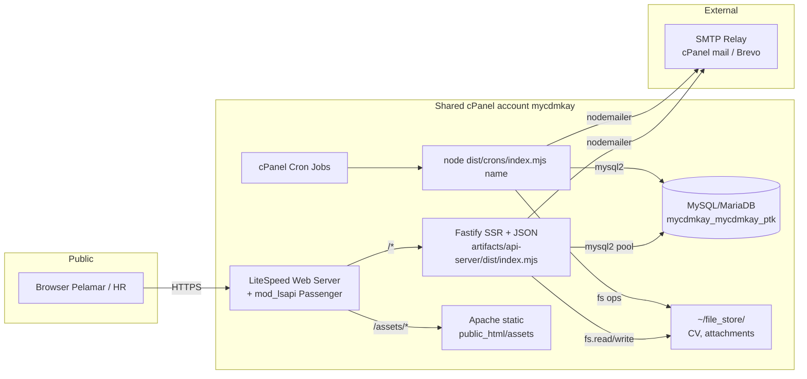
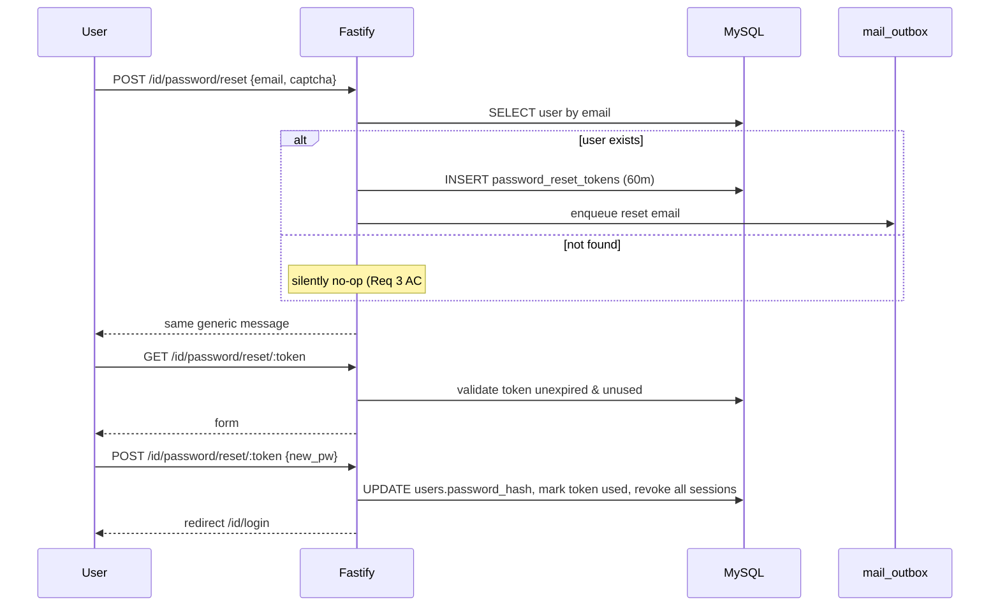
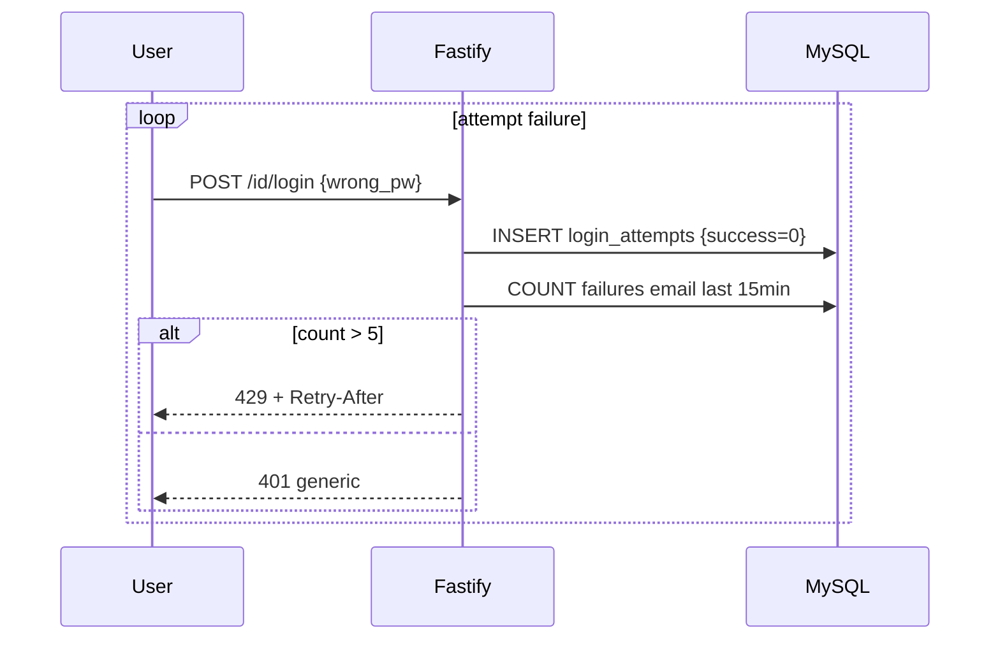
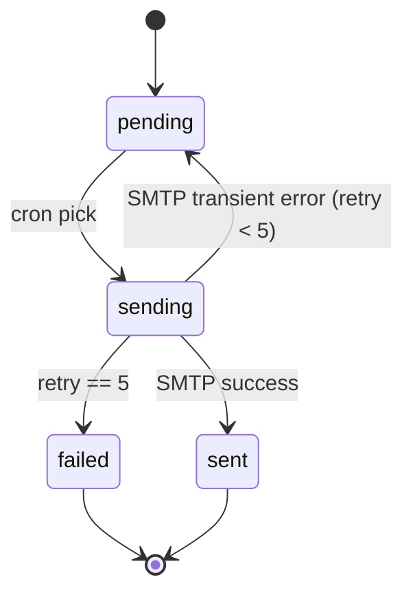
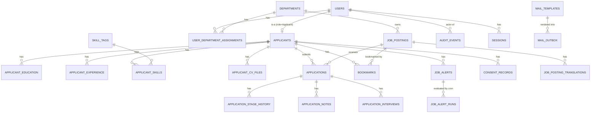

# Design Document

## Overview

Dokumen ini menjabarkan desain teknis **PT Buana Megah Job Portal (The_Portal)** sesuai requirements.md. Tujuan inti: membangun ATS modern (Public_Site, Applicant_Area, Admin_Console) yang dapat dideploy dan dijalankan **sepenuhnya di shared hosting cPanel** dari HyperCloudHost, tanpa Docker, tanpa root, tanpa daemon kustom, dan tanpa layanan eksternal selain SMTP.

### Pendekatan utama

- **Single Node.js Fastify app** yang sekaligus men-render SSR HTML (Nunjucks) untuk Public_Site, Applicant_Area, dan Admin_Console, dan menyediakan endpoint JSON/HTML-fragment untuk interaksi dinamis melalui **htmx + Alpine.js** (light interactivity tanpa SPA framework).
- Satu schema **MySQL/MariaDB** sebagai datastore tunggal, dengan **FULLTEXT ngram** untuk pencarian.
- Semua pekerjaan terjadwal lewat **cPanel cron jobs** memanggil **CLI dispatcher Node** yang berbagi codebase dengan API_Server (mail outbox, job alert digest, backup, GC session, archival).
- File upload disimpan di disk lokal di luar `public_html` dan dilayani melalui endpoint Fastify yang menerapkan otorisasi.
- Konfigurasi rahasia masuk lewat environment variable Passenger ("Setup Node.js App"), tidak via file `.env`.

### Non-goals

- **Tidak** menggunakan microservices, message broker, in-memory cache eksternal (Redis/Memcached), atau search engine eksternal (Elasticsearch/Meilisearch).
- **Tidak** membangun mobile native app — fokus pada web responsive.
- **Tidak** menyediakan SSO/SAML untuk pelamar (login email + password + verifikasi email saja). Social login adalah open question (lihat §24).
- **Tidak** menerapkan CI/CD otomatis ke cPanel; deployment tetap manual via Git Version Control + Terminal.

### Tradeoffs utama

| Tradeoff | Pilihan | Alasan |
|---|---|---|
| SSR vs SPA | SSR Nunjucks | SEO Google for Jobs (Req 2 AC #5), LCP <2.5s realistis di shared hosting, footprint memori kecil |
| Persistent worker vs cron | cron only | cPanel tidak izinkan daemon, Passenger akan kill idle workers |
| Redis cache vs MySQL | MySQL | Tidak ada Redis di shared hosting; throughput cukup untuk workload portal karier |
| Background queue (BullMQ) vs DB outbox | DB outbox + cron flush | Sama: tidak ada Redis; outbox pattern cocok dengan transactional consistency |
| Native search engine vs FULLTEXT | FULLTEXT MySQL | Cukup untuk ≤5.000 lowongan (Req 6 AC #3); tidak butuh Elasticsearch |
| argon2 vs bcrypt | bcrypt cost 12 | Honor Requirement 3 AC #10; argon2 jadi roadmap masa depan |

---

## Architecture

### 2.1 Topologi runtime



### 2.2 Lifecycle request

**SSR HTML (mis. `GET /id/jobs`):**
1. LiteSpeed terima HTTPS, periksa rule `.htaccess`, forward ke Passenger.
2. Passenger pilih worker Node yang sedang idle (atau spawn baru jika di bawah limit).
3. Fastify routing → middleware (locale resolve, session load, CSRF, rate limit pasif untuk GET) → handler.
4. Handler query MySQL pool, render Nunjucks template `views/public/jobs.njk` dengan data + JSON-LD JobPosting.
5. Kirim response dengan header `Cache-Control: public, max-age=300`, `ETag`, security headers (Helmet), `Content-Language`.

**JSON / HTML-fragment (mis. `POST /api/applications/:id/stage` dari htmx):**
1. Sama sampai routing.
2. Middleware CSRF cek `X-CSRF-Token` vs cookie session.
3. Service layer eksekusi transaksi: update `applications`, append `application_stage_history`, insert `audit_events`, enqueue `mail_outbox`.
4. Response: HTML fragment kanban card baru (htmx swap) atau JSON `{ ok: true, stage: "Interview" }` tergantung `Accept` header.

---

## Components and Interfaces

Bagian ini menjelaskan komponen runtime, antarmuka HTTP, dan modul pendukung. Setiap subbagian sesuai dengan komponen logis yang telah diidentifikasi pada arsitektur, dan terhubung kembali ke acceptance criteria pada requirements.md.

### 3. Technology Stack

| Komponen | Pilihan | Alasan singkat |
|---|---|---|
| Web framework | **Fastify 4.x** | Footprint memori kecil, schema validation built-in, kompatibel Passenger |
| Template engine | **Nunjucks 3.x** | Sintaks Jinja-like, autoescape on, async filter support |
| MySQL driver | **mysql2/promise** | Prepared statement native, connection pool, fast |
| Session store | **MySQL `sessions` table** | Tidak ada Redis; bisa GC via cron |
| Validation | **zod** | Type-safe, schema reusable untuk forms dan API |
| Password hash | **bcrypt** cost 12 | Sesuai Requirement 3 AC #10 |
| CSRF | **@fastify/csrf-protection** | Double-submit token, default secure |
| Headers | **@fastify/helmet** | CSP, HSTS, X-Frame-Options, Referrer-Policy |
| Multipart upload | **@fastify/multipart** + **file-type** | Stream upload, magic-byte sniff |
| Logger | **pino** | JSON ke stdout, ditangkap Passenger log |
| SMTP | **nodemailer** | SMTP biasa, kompatibel cPanel mail dan Brevo |
| Cron CLI | **commander** | Sub-command dispatcher untuk `crons/index.mjs <name>` |
| Frontend interaktif | **htmx 1.x + Alpine.js 3.x** (vendored) | Tanpa SPA bundle, ramah CSP |
| CSS | **Tailwind CSS** prebuilt | File CSS final di-build saat deploy |
| Captcha | **hCaptcha** (default) | Free tier, GDPR-friendly |
| ID generator | **ulid** atau **uuid v7** | Time-sortable, aman untuk URL |
| ORM/Query builder | **Kysely** atau plain mysql2 | Pilih plain mysql2 untuk minimum dependency; helper builder kecil di-`infra/db.ts` |

Semua dependency diinstal via `npm ci` dari cPanel "Run NPM Install" atau Terminal. Tidak ada native binary yang butuh kompilasi (bcrypt punya prebuilt Node 22 binary).

---

### 4. Frontend Approach

#### 4.1 Layout SSR

```
src/views/
├── layouts/
│   ├── public.njk        # Public_Site (header navigasi, footer, language switch)
│   ├── applicant.njk     # Applicant_Area (sidebar profile, applications, alerts)
│   └── admin.njk         # Admin_Console (sidebar role-aware nav)
├── partials/
│   ├── header.njk
│   ├── footer.njk
│   ├── job-card.njk
│   ├── kanban-card.njk
│   └── flash.njk
├── public/
│   ├── home.njk
│   ├── about.njk
│   ├── jobs.njk
│   └── job-detail.njk
├── applicant/
│   ├── dashboard.njk
│   ├── profile.njk
│   ├── applications.njk
│   ├── application-detail.njk
│   ├── bookmarks.njk
│   └── alerts.njk
├── admin/
│   ├── dashboard.njk
│   ├── jobs-list.njk
│   ├── job-form.njk
│   ├── kanban.njk
│   ├── application-detail.njk
│   ├── audit.njk
│   ├── reports.njk
│   └── diagnostics.njk
└── emails/               # Template email (rendered server-side)
    ├── verify.njk
    ├── reset.njk
    ├── application-confirm.njk
    └── stage-change.njk
```

#### 4.2 Pola interaksi htmx

- **Bookmark toggle** (Req 6 AC #4):  
  ```html
  <button hx-post="/api/bookmarks/toggle"
          hx-vals='{"jobId":"{{ job.id }}"}'
          hx-headers='{"X-CSRF-Token":"{{ csrf }}"}'
          hx-swap="outerHTML">
    ★☆
  </button>
  ```
- **Kanban drag-drop** (Req 10 AC #2): Alpine.js + Sortable.js (vendored) memicu `hx-post /api/applications/:id/stage` saat drop; server merespon dengan card HTML baru.
- **Search filter** (Req 6 AC #1-3): form GET dengan `hx-trigger="change delay:300ms"` dan `hx-push-url=true`, server mengembalikan list HTML.

#### 4.3 SEO & performance

- **JSON-LD `JobPosting`** disisipkan di `<head>` `job-detail.njk` dengan properti minimum: `@context`, `@type`, `title`, `description`, `datePosted`, `validThrough`, `employmentType`, `hiringOrganization`, `jobLocation`, `baseSalary` (jika ada).
- **Sitemap dinamis** `/sitemap.xml` di-generate on-the-fly, di-cache 5 menit via `Cache-Control: public, max-age=300`.
- **`hreflang`** alternate untuk `/id/jobs/:slug` ↔ `/en/jobs/:slug`.
- **LCP <2.5s** (Req 2 AC #10):
  - Critical CSS inline (≤14KB)
  - Defer JS (htmx + Alpine), `<link rel="preconnect">` untuk hCaptcha
  - Image dimensi ditetapkan, `loading="lazy"` di list
  - Brotli/gzip aktif via `.htaccess`
  - Server-side cache: list `/jobs` di-cache 60 detik di in-memory LRU (max 100 entries) untuk variasi filter populer

---

### 5. Repository Structure

```
ptk-app/
├── artifacts/
│   └── api-server/
│       └── dist/
│           ├── index.mjs            # Passenger entry (build output)
│           └── crons/
│               └── index.mjs        # Cron CLI dispatcher
├── src/
│   ├── server.ts                    # Fastify bootstrap
│   ├── routes/
│   │   ├── public.ts
│   │   ├── auth.ts
│   │   ├── applicant.ts
│   │   ├── admin.ts
│   │   └── api.ts
│   ├── modules/
│   │   ├── auth/                    # register, verify, login, reset, sessions
│   │   ├── applicant/               # profile, education, experience, CV
│   │   ├── jobs/                    # CRUD, slug, search, FULLTEXT reindex
│   │   ├── applications/            # apply, withdraw, stage transitions
│   │   ├── alerts/                  # job alerts CRUD + digest evaluator
│   │   ├── audit/                   # writer service
│   │   ├── mail/                    # outbox enqueue, sender, templates
│   │   ├── reporting/               # dashboard queries, CSV export
│   │   ├── i18n/                    # locale resolver, translation lookup
│   │   └── security/                # rate limiter, captcha verify
│   ├── infra/
│   │   ├── db.ts                    # mysql2 pool factory
│   │   ├── session-store.ts
│   │   ├── rate-limiter.ts          # MySQL-backed
│   │   ├── cron-lock.ts             # GET_LOCK or cron_locks heartbeat
│   │   └── disk.ts                  # File_Store path helper, quota check
│   ├── views/                       # Nunjucks templates (lihat §4)
│   ├── locales/
│   │   ├── id.json
│   │   └── en.json
│   ├── crons/
│   │   ├── index.ts                 # commander dispatcher
│   │   ├── mail-flush.ts
│   │   ├── alert-digest.ts
│   │   ├── backup-daily.ts
│   │   ├── file-archive.ts
│   │   ├── audit-archive.ts
│   │   ├── search-reindex.ts
│   │   └── session-gc.ts
│   └── public/                      # disalin ke public_html/assets saat deploy
│       ├── css/app.css              # Tailwind output
│       ├── js/htmx.min.js
│       ├── js/alpine.min.js
│       ├── js/sortable.min.js
│       └── img/
├── migrations/
│   ├── 0001_init.sql
│   ├── 0002_jobs.sql
│   ├── 0003_applications.sql
│   ├── 0004_alerts.sql
│   ├── 0005_audit.sql
│   └── ...
├── tools/
│   └── migrate.mjs                  # CLI: node tools/migrate.mjs up|down|status
├── tests/
│   ├── unit/
│   ├── integration/
│   └── pbt/                         # fast-check property tests
├── package.json
├── tsconfig.json
├── tailwind.config.js
└── .htaccess.template               # disalin ke public_html/.htaccess saat deploy
```

Cron scripts berbagi modul `src/modules/*` dan `src/infra/*` dengan API_Server, sehingga business logic tidak duplikat. Build menghasilkan `artifacts/api-server/dist/` yang berisi entry server **dan** entry cron dalam satu output bundle (esbuild atau tsc).


---

### 6. HTTP Routing Map

Locale prefix `/id` atau `/en` berlaku untuk semua route HTML. Default redirect `/` → `/id/`.

#### Public_Site (Req 2, 6, 17)

| Method | Path | Handler | Auth | Response | Req |
|---|---|---|---|---|---|
| GET | `/` | redirect `/id/` | none | 302 | 17.2 |
| GET | `/{locale}/` | `public.home` | none | HTML | 2.1 |
| GET | `/{locale}/about` | `public.about` | none | HTML | 2.2 |
| GET | `/{locale}/jobs` | `public.jobsList` | none | HTML | 2.3, 6.1-3 |
| GET | `/{locale}/jobs/:slug` | `public.jobDetail` | none | HTML + JSON-LD | 2.4-5, 2.8 |
| GET | `/sitemap.xml` | `public.sitemap` | none | XML | 2.6 |
| GET | `/robots.txt` | `public.robots` | none | text | 2.7 |
| GET | `/healthz` | `ops.health` | none | JSON | 20.3 |
| POST | `/{locale}/contact` | `public.contact` | captcha | HTML | 14.1 |

#### Auth (Req 3)

| Method | Path | Handler | Auth | Response | Req |
|---|---|---|---|---|---|
| GET | `/{locale}/register` | `auth.registerForm` | none | HTML | 3.1 |
| POST | `/{locale}/register` | `auth.register` | captcha + rate-limit | redirect | 3.1-2 |
| GET | `/{locale}/verify` | `auth.verify` | none (token) | HTML | 3.3-4 |
| POST | `/{locale}/verify/resend` | `auth.resendVerify` | rate-limit | HTML | 3.4 |
| GET | `/{locale}/login` | `auth.loginForm` | none | HTML | 3.5 |
| POST | `/{locale}/login` | `auth.login` | rate-limit + captcha | redirect | 3.5-7 |
| POST | `/{locale}/logout` | `auth.logout` | session | redirect | 3.5 |
| GET | `/{locale}/password/reset` | `auth.resetForm` | none | HTML | 3.8 |
| POST | `/{locale}/password/reset` | `auth.requestReset` | captcha + rate-limit | HTML | 3.8-9 |
| GET | `/{locale}/password/reset/:token` | `auth.resetTokenForm` | token | HTML | 3.8 |
| POST | `/{locale}/password/reset/:token` | `auth.resetPassword` | token | redirect | 3.8 |

#### Applicant_Area (Req 4, 5, 6, 7, 8, 16)

Semua memerlukan session Applicant valid.

| Method | Path | Handler | Response | Req |
|---|---|---|---|---|
| GET | `/{locale}/me` | dashboard | HTML | 4, 5 |
| GET/POST | `/{locale}/me/profile` | profile form | HTML | 4.1-4 |
| GET/POST | `/{locale}/me/profile/education` | CRUD education | HTML | 4.2 |
| GET/POST | `/{locale}/me/profile/experience` | CRUD experience | HTML | 4.3 |
| POST | `/{locale}/me/profile/skills` | add/remove skill tag | HTML fragment | 4.4 |
| POST | `/{locale}/me/cv` | upload CV | HTML fragment | 4.5-8 |
| GET | `/{locale}/me/cv/:id` | download CV | binary | 15.6 |
| GET | `/{locale}/me/applications` | list | HTML | 5.6 |
| GET | `/{locale}/me/applications/:id` | detail + timeline | HTML | 5.7 |
| POST | `/{locale}/me/applications/:id/withdraw` | withdraw | redirect | 5.8 |
| POST | `/api/applications` | apply (htmx) | HTML fragment | 5.1-4 |
| POST | `/api/bookmarks/toggle` | toggle bookmark | HTML fragment | 6.4 |
| GET | `/{locale}/me/bookmarks` | list bookmarks | HTML | 6.5-6 |
| GET/POST | `/{locale}/me/alerts` | CRUD job alert | HTML | 7.1 |
| GET | `/{locale}/me/data-export` | request export | HTML / JSON download | 16.2 |
| POST | `/{locale}/me/account/delete` | request deletion | HTML | 16.3 |
| POST | `/{locale}/me/consent` | accept new policy | redirect | 16.6 |

#### Admin_Console (Req 9, 10, 11, 12, 13, 18)

Memerlukan session role Super_Admin / HR / Department_Head.

| Method | Path | Handler | Role | Req |
|---|---|---|---|---|
| GET | `/admin` | dashboard | any internal | 13.1 |
| GET/POST | `/admin/jobs` | list / create | HR, Super_Admin | 9.1-2 |
| GET/POST | `/admin/jobs/:id` | edit | HR, Super_Admin | 9.1, 9.6-7 |
| POST | `/admin/jobs/:id/publish` | publish | HR, Super_Admin | 9.3 |
| POST | `/admin/jobs/:id/close` | close/archive | HR, Super_Admin | 9.4 |
| POST | `/admin/jobs/:id/clone` | clone | HR, Super_Admin | 9.5 |
| GET | `/admin/jobs/:id/kanban` | kanban view | HR, Super_Admin, Dept_Head (assigned) | 10.1 |
| POST | `/api/applications/:id/stage` | stage transition (htmx) | HR, Super_Admin | 10.2 |
| POST | `/api/applications/bulk-stage` | bulk transition | HR, Super_Admin | 10.5-6 |
| GET/POST | `/admin/applications/:id/notes` | add note | HR, Super_Admin, Dept_Head | 10.3 |
| POST | `/admin/applications/:id/interview` | schedule interview | HR, Super_Admin | 10.4 |
| POST | `/admin/applications/:id/email` | send templated email | HR, Super_Admin | 10.7 |
| GET | `/admin/audit` | audit log | Super_Admin | 12.3 |
| GET | `/admin/users` | user list | Super_Admin | 11.7 |
| POST | `/admin/users/invite` | invite | Super_Admin | 11.7 |
| GET | `/admin/reports` | reports dashboard | HR, Super_Admin | 13.1-3 |
| GET | `/admin/reports/jobs/:id/export.csv` | CSV export | HR, Super_Admin | 13.4-5 |
| GET | `/admin/diagnostics` | diagnostics | Super_Admin | 20.4 |
| GET | `/admin/backups` | list backups | Super_Admin | 18.4 |
| GET | `/admin/backups/:filename` | download | Super_Admin | 18.4 |

---

### 8. Authentication & Sessions

#### 8.1 Sequence: register → verify → login

```mermaid
sequenceDiagram
    participant U as Visitor
    participant F as Fastify (web)
    participant DB as MySQL
    participant OB as mail_outbox
    participant CR as Cron mail-flush
    participant SMTP as SMTP relay
    participant V as Email client

    U->>F: POST /id/register {email, pw, consent, captcha}
    F->>F: validate (zod), captcha verify, rate-limit
    F->>DB: INSERT users (status=pending), applicants
    F->>DB: INSERT consent_records
    F->>DB: INSERT verification_tokens (24h)
    F->>OB: enqueue verify email
    F-->>U: 200 "Cek email Anda"
    Note over CR,SMTP: cron */2 min
    CR->>OB: SELECT pending LIMIT 200
    CR->>SMTP: send
    SMTP-->>V: deliver
    V->>F: GET /id/verify?token=...
    F->>DB: validate token, mark user.status=active, invalidate token
    F-->>V: redirect /id/login
    V->>F: POST /id/login
    F->>DB: SELECT user, bcrypt.compare
    F->>DB: INSERT sessions (id, csrf_token, expires_at)
    F-->>V: Set-Cookie sid; redirect /id/me
```

#### 8.2 Sequence: password reset



#### 8.3 Sequence: lockout



#### 8.4 Session lifecycle

- Cookie name `__Host-sid` (jika apex HTTPS), atribut `HttpOnly; Secure; SameSite=Lax; Path=/`.
- ID = 32 byte random base64url (43 char).
- `last_active_at` di-update setiap request authenticated; idle >30 menit invalid.
- `expires_at` = `created_at + 12 jam` (absolute timeout).
- GC: cron `session-gc` setiap jam menjalankan `DELETE FROM sessions WHERE expires_at < NOW() OR last_active_at < NOW() - INTERVAL 30 MINUTE`.

#### 8.5 Password hashing

- bcrypt cost 12 saat register dan reset password (Req 3 AC #10).
- `password_hash` kolom `VARCHAR(72)` (cukup untuk format bcrypt).
- Passwords dipotong tersirat di 72 byte oleh bcrypt; UI memvalidasi panjang max 128 char dan minimum 10 char dengan huruf+digit.

#### 8.6 CSRF

- Token dibuat saat session dibuat, disimpan di `sessions.csrf_token`, dikirim ke client via cookie `csrf_token` (non-HttpOnly) dan via meta tag `<meta name="csrf-token">`.
- Setiap request POST/PUT/PATCH/DELETE harus membawa header `X-CSRF-Token` (htmx) atau form field `_csrf` yang sama dengan cookie + sessions row.

---

### 9. File Upload Pipeline

```mermaid
flowchart TD
    A[Browser POST multipart] --> B[@fastify/multipart stream]
    B --> C{size > 5MB?}
    C -- yes --> R413[413 Payload Too Large]
    C -- no --> D[Write to ~/tmp/uploads/uuid.tmp]
    D --> E[file-type sniff first 4100 bytes]
    E --> F{magic bytes valid PDF/DOC/DOCX?}
    F -- no --> R415[415 + delete tmp]
    F -- yes --> G[fs.rename to ~/file_store/cv/yyyy/mm/uuid.ext]
    G --> H[INSERT applicant_cv_files is_active=1]
    H --> I[UPDATE older rows is_active=0]
    I --> J{count active+history > 3?}
    J -- yes --> K[delete oldest file + row]
    J -- no --> END[200 fragment]
```

- `~/file_store` = `/home/mycdmkay/file_store/`, mode `0700`.
- Endpoint download `GET /me/cv/:id`:
  - Authz: pemilik file ATAU role HR/Super_Admin yang memiliki Application yang merujuk file ini.
  - Header: `Content-Disposition: attachment; filename="cv.pdf"`, `X-Content-Type-Options: nosniff`, `Cache-Control: private, no-store`.
- Quota guard sebelum upload: cek `df` via `fs.statfs(homedir)`; jika free < 100 MB, tolak dengan 507 Insufficient Storage.

---

### 10. Search Design

#### 10.1 Indexing

- `job_postings.search_text` di-recompute setiap kali title/description/requirements/responsibilities diubah:
  ```ts
  const searchText = [trans.id?.title, trans.id?.description, trans.id?.requirements,
                      trans.en?.title, trans.en?.description, skills.join(' ')]
                      .filter(Boolean).join(' \n ');
  ```
- `FULLTEXT KEY ft_job_search (search_text) WITH PARSER ngram` mendukung token 2-gram untuk teks ID/EN.

#### 10.2 Query

```sql
-- Search dengan filter: keyword "data analyst", lokasi {Jakarta, Surabaya}, level senior
SELECT j.id, j.slug, t.title, j.location, j.employment_type, j.published_at
FROM job_postings j
JOIN job_posting_translations t ON t.job_id = j.id AND t.locale = ?
WHERE j.status = 'Published'
  AND (j.application_deadline IS NULL OR j.application_deadline >= CURDATE())
  AND (? = '' OR MATCH(j.search_text) AGAINST (? IN BOOLEAN MODE))
  AND (j.location IN (?, ?))
  AND (j.level = 'senior')
ORDER BY j.published_at DESC
LIMIT 20 OFFSET 0;
```

- Keyword diquote dengan `+` untuk AND-ing tokens, `*` untuk wildcard. Service layer melakukan sanitasi karakter operator.
- Pagination cap: `OFFSET <= 200` (10 halaman). Halaman lebih dalam diarahkan ke "refine your search".

#### 10.3 Filter facets

Dihitung dengan satu agregasi terpisah per filter (executed paralel oleh Fastify):
```sql
SELECT location, COUNT(*) FROM job_postings WHERE status='Published' GROUP BY location;
```
Di-cache 60 detik dalam in-memory LRU per worker.

#### 10.4 Reindex

- Pada CREATE/UPDATE Job_Posting, service `jobs.repo.save()` mengkomputasi ulang `search_text` dalam transaksi yang sama.
- Cron `search-reindex` (mingguan) menjalankan `OPTIMIZE TABLE job_postings;` di luar jam sibuk.

---

### 11. Cron_Runner Design

#### 11.1 Dispatcher

`src/crons/index.ts` menggunakan commander:

```ts
program
  .name('crons')
  .command('mail-flush').action(() => runWithLock('mail-flush', mailFlush))
  .command('alert-digest').action(() => runWithLock('alert-digest', alertDigest))
  .command('backup-daily').action(() => runWithLock('backup-daily', backupDaily))
  .command('session-gc').action(() => runWithLock('session-gc', sessionGc))
  .command('file-archive').action(() => runWithLock('file-archive', fileArchive))
  .command('audit-archive').action(() => runWithLock('audit-archive', auditArchive))
  .command('search-reindex').action(() => runWithLock('search-reindex', searchReindex));
program.parse();
```

`runWithLock(name, fn)`:
1. `INSERT INTO cron_locks (name, locked_at, heartbeat_at) VALUES (?, NOW(), NOW()) ON DUPLICATE KEY UPDATE locked_at = IF(heartbeat_at < NOW() - INTERVAL 90 SECOND, NOW(), locked_at), heartbeat_at = IF(heartbeat_at < NOW() - INTERVAL 90 SECOND, NOW(), heartbeat_at);`
2. Jika `locked_at` bukan dari proses ini → exit 0 (overlap).
3. Heartbeat setiap 10 detik.
4. Jalankan `fn()` dengan timeout 55 detik.
5. UPDATE `last_run_at`, `last_status`, `last_error`.

#### 11.2 cPanel crontab entries

```cron
# Mail outbox flush every 2 minutes (max 200 rows/run)
*/2 * * * *   /home/mycdmkay/nodevenv/ptk-app/22/bin/node /home/mycdmkay/ptk-app/dist/crons/index.mjs mail-flush >> /home/mycdmkay/logs/cron-mail.log 2>&1

# Job alert digest evaluation every 15 minutes
*/15 * * * *  /home/mycdmkay/nodevenv/ptk-app/22/bin/node /home/mycdmkay/ptk-app/dist/crons/index.mjs alert-digest >> /home/mycdmkay/logs/cron-alert.log 2>&1

# Session GC hourly
5 * * * *     /home/mycdmkay/nodevenv/ptk-app/22/bin/node /home/mycdmkay/ptk-app/dist/crons/index.mjs session-gc >> /home/mycdmkay/logs/cron-gc.log 2>&1

# Daily backup at 02:00 server time
0 2 * * *     /home/mycdmkay/nodevenv/ptk-app/22/bin/node /home/mycdmkay/ptk-app/dist/crons/index.mjs backup-daily >> /home/mycdmkay/logs/cron-backup.log 2>&1

# Search optimize weekly Sunday 03:30
30 3 * * 0    /home/mycdmkay/nodevenv/ptk-app/22/bin/node /home/mycdmkay/ptk-app/dist/crons/index.mjs search-reindex >> /home/mycdmkay/logs/cron-search.log 2>&1

# File archive monthly day 1 04:00
0 4 1 * *     /home/mycdmkay/nodevenv/ptk-app/22/bin/node /home/mycdmkay/ptk-app/dist/crons/index.mjs file-archive >> /home/mycdmkay/logs/cron-arch.log 2>&1

# Audit archive monthly day 2 04:30
30 4 2 * *    /home/mycdmkay/nodevenv/ptk-app/22/bin/node /home/mycdmkay/ptk-app/dist/crons/index.mjs audit-archive >> /home/mycdmkay/logs/cron-audit.log 2>&1
```

#### 11.3 Batching

- `mail-flush`: `SELECT ... WHERE status='pending' AND next_attempt_at <= NOW() ORDER BY id LIMIT 200`. Tiap email dikirim, status di-update transaksional.
- `alert-digest`: ambil `job_alerts WHERE last_evaluated_at IS NULL OR ...`, batasi 500 alert per run. Sisanya dikerjakan run berikutnya (loop natural lewat penjadwalan cron).

---

### 12. Mail Outbox

#### 12.1 State machine



#### 12.2 Backoff

`next_attempt_at` ditambah dengan: `[1m, 5m, 15m, 1h, 6h]` per `retry_count`. Setelah 5 gagal → `status='failed'`, alert ke Super_Admin via email khusus (atau via dashboard).

#### 12.3 Idempotency

- Setiap aksi domain memanggil `mailService.enqueue(opts)` di dalam transaksi yang sama. `INSERT IGNORE` dengan natural key (kombinasi `template_key` + `target_id`) opsional untuk pesan yang tidak boleh dobel (mis. application-confirm).
- `cron mail-flush` mengubah baris ke `status='sending'` dengan `UPDATE ... WHERE status='pending'` lalu `affectedRows`-check sebelum kirim, mencegah dua proses menangani baris sama.

---

### 13. i18n

- URL prefix wajib: `/id/...` atau `/en/...`.
- Locale resolver: prefix → cookie `lang` → `Accept-Language` → default `id`.
- File terjemahan UI: `src/locales/id.json`, `src/locales/en.json` flat key (`auth.login.title`).
- Template Nunjucks pakai filter `{{ 'auth.login.title' | t }}` yang otomatis fallback ke id.
- Konten Job_Posting disimpan di `job_posting_translations`. Detail page render bahasa aktif; jika hanya satu locale tersedia, render apa yang ada dengan badge "Original Language".

---

### 14. RBAC

#### 14.1 Policy map

```ts
const policies = {
  'job.create':    ['Super_Admin', 'HR'],
  'job.publish':   ['Super_Admin', 'HR'],
  'job.read':      ['Super_Admin', 'HR', 'Department_Head'],
  'application.note.add':  ['Super_Admin', 'HR', 'Department_Head'],
  'application.stage.change': ['Super_Admin', 'HR'],
  'application.export':  ['Super_Admin', 'HR'],
  'user.invite':   ['Super_Admin'],
  'audit.read':    ['Super_Admin'],
  'backup.read':   ['Super_Admin'],
};
```

#### 14.2 Department scoping

`Department_Head`: middleware menambahkan `req.scope.departments = [...assignedIds]`. Repository layer **selalu** menambahkan `WHERE j.department_id IN (?)` untuk operasi read di entitas `job_postings`/`applications` yang melibatkan Dept_Head.

#### 14.3 Denial

Jika kebijakan tidak terpenuhi: respond 403 + render template `403.njk`, tulis `audit_events { action_type='AccessDenied', target_entity, target_id }`.

---

### 15. Audit Log

`auditService.write({ actor, action, target, details, ip })` dipanggil dari setiap aksi domain (publish, stage change, export, login). Tabel insert-only; arsip oleh cron `audit-archive` jika `> 5_000_000` rows.

Aksi yang dicatat (Req 12 AC #1): login_success, login_failure, password_reset_request, password_change, role_change, job_create, job_publish, job_unpublish, application_stage_change, data_export, mail_template_change, config_change.

---

### 16. Reporting

#### 16.1 Time-to-hire

```sql
SELECT j.id, j.slug,
  AVG(TIMESTAMPDIFF(DAY, a.applied_at, a.hired_at)) AS avg_tth_days
FROM applications a
JOIN job_postings j ON j.id = a.job_id
WHERE a.stage = 'Hired' AND a.hired_at BETWEEN ? AND ?
GROUP BY j.id;
```

#### 16.2 Conversion rate Applied → Interview

```sql
SELECT
  SUM(CASE WHEN h.new_stage IN ('Interview','Offer','Hired') THEN 1 ELSE 0 END) /
  COUNT(DISTINCT a.id) AS conv_app_to_interview
FROM applications a
LEFT JOIN application_stage_history h ON h.application_id = a.id
WHERE a.applied_at BETWEEN ? AND ?;
```

#### 16.3 CSV export

- Endpoint streams via Fastify reply.raw: header `Content-Type: text/csv; charset=utf-8; Content-Disposition: attachment`.
- Row cap 10.000 (Req 13 refinement). Lebih dari itu → 422 dengan saran filter sempit.
- CV download URL = signed link `/me/cv/:id?sig=hmac&exp=...` valid 60 menit.
- Insert `audit_events { action_type='DataExport', details: { rows, job_id } }`.

---

### 17. Backup Strategy

`crons/backup-daily.ts` melakukan:

```bash
mysqldump --single-transaction --quick --routines --triggers --no-tablespaces \
  -h "$DB_HOST" -u "$DB_USER" -p"$DB_PASS" "$DB_NAME" \
  | gzip -9 > "$BACKUP_DIR/db-$(date +%F).sql.gz"

tar --exclude='*.tmp' -czf "$BACKUP_DIR/files-$(date +%F).tar.gz" -C "$HOME" file_store
```

- `BACKUP_DIR=/home/mycdmkay/backups` (di luar `public_html`, mode 0700).
- Verifikasi: `gzip -t` untuk file SQL, `tar -tzf | head` untuk file tar; jika gagal → tandai invalid + alert email.
- Retensi: keep 14 daily; pada tanggal 1 setiap bulan, copy file harian terbaru ke `BACKUP_DIR/monthly/` lalu prune monthly >12.
- Endpoint download `/admin/backups/:filename` (Super_Admin only) dengan signed URL.

---

### 18. Observability

#### 18.1 Logger

pino default config: JSON ke stdout, level dari env `LOG_LEVEL` (default `info`).

Setiap request log entry:
```json
{"level":"info","time":1716...,"req_id":"01HZ...","method":"GET","route":"/id/jobs",
 "status":200,"latency_ms":48,"user_id":1234,"ip":"1.2.3.4","ua":"..."}
```

#### 18.2 `/healthz`

```ts
app.get('/healthz', async (req, reply) => {
  try {
    await pool.query({ sql: 'SELECT 1', timeout: 1000 });
    reply.code(200).send({ status: 'ok' });
  } catch {
    reply.code(503).send({ status: 'db_unreachable' });
  }
});
```

#### 18.3 `/admin/diagnostics`

Mengembalikan: `process.uptime()`, `process.version`, `process.memoryUsage().rss`, `SELECT COUNT(*) FROM mail_outbox WHERE status='pending'`, `SELECT name, last_run_at, last_status FROM cron_locks`, mtime backup terbaru.

---

### 19. Security Controls Summary

- **CSP**: `default-src 'self'; script-src 'self' 'nonce-{{nonce}}'; style-src 'self' 'unsafe-inline'; img-src 'self' data:; frame-ancestors 'none'; form-action 'self'; base-uri 'self'`.
- **HSTS**: `Strict-Transport-Security: max-age=31536000; includeSubDomains; preload`.
- **X-Frame-Options**: `DENY`. **X-Content-Type-Options**: `nosniff`. **Referrer-Policy**: `strict-origin-when-cross-origin`. **Permissions-Policy**: minimal.
- **CSRF**: double-submit token; reject jika tidak match.
- **Prepared statements**: semua query via mysql2 placeholder API; review otomatis oleh ESLint rule `no-string-concat-sql`.
- **Magic-byte validation**: `file-type` package memvalidasi PDF/DOC/DOCX sebelum persist.
- **Secrets**: env vars di Passenger ("Setup Node.js App" → environment variables): `DATABASE_URL`, `SESSION_SECRET`, `SMTP_HOST`, `SMTP_USER`, `SMTP_PASS`, `CAPTCHA_SECRET`, `BASE_URL`, `NODE_ENV`. Tidak ada `.env` di repository.
- **Lockout**: 5 percobaan dalam 15 menit per email → 429 + Retry-After.
- **Slug + filename sanitization**: file disimpan dengan UUID; original filename hanya digunakan di header download.

---

### 20. Performance Budget

#### 20.1 mysql2 pool

```ts
import mysql from 'mysql2/promise';
export const pool = mysql.createPool({
  uri: process.env.DATABASE_URL,
  connectionLimit: 10,
  queueLimit: 50,
  waitForConnections: true,
  enableKeepAlive: true,
  keepAliveInitialDelay: 0,
  namedPlaceholders: true,
  timezone: 'Z',
  decimalNumbers: true,
});
```

#### 20.2 Cache

- `Cache-Control: public, max-age=300, s-maxage=600` di `/jobs` dan `/jobs/:slug` (revalidate via `ETag` dari `updated_at` row).
- LRU in-memory `quick-lru` (max 100 entries) di setiap worker untuk halaman list dengan filter populer; TTL 60 detik.

#### 20.3 .htaccess sample (`public_html/.htaccess`)

```apache
# Passenger handles all dynamic routes; static assets served by Apache directly.
RewriteEngine On

# Redirect www → bare apex
RewriteCond %{HTTP_HOST} ^www\.(.+)$ [NC]
RewriteRule ^ https://%1%{REQUEST_URI} [R=301,L]

# Force HTTPS (cPanel AutoSSL)
RewriteCond %{HTTPS} !=on
RewriteRule ^ https://%{HTTP_HOST}%{REQUEST_URI} [R=301,L]

# Allow .well-known for ACME
RewriteRule ^\.well-known/ - [L]

# Cache static assets aggressively
<IfModule mod_expires.c>
  ExpiresActive On
  ExpiresByType text/css "access plus 30 days"
  ExpiresByType application/javascript "access plus 30 days"
  ExpiresByType image/svg+xml "access plus 30 days"
  ExpiresByType image/webp "access plus 30 days"
  ExpiresByType font/woff2 "access plus 365 days"
</IfModule>

# Compression (LiteSpeed handles brotli automatically; mod_deflate fallback)
<IfModule mod_deflate.c>
  AddOutputFilterByType DEFLATE text/html text/css application/javascript application/json image/svg+xml
</IfModule>

# Block hidden files
<FilesMatch "^\.">
  Require all denied
</FilesMatch>

# Passenger app config (auto-generated by cPanel "Setup Node.js App")
# Do not remove the markers below
# >>> PASSENGER START
# (managed)
# <<< PASSENGER END
```

---

### 21. Deployment on cPanel

1. **Database**: cPanel → MySQL Databases → buat schema `mycdmkay_mycdmkay_ptk` + user + password.
2. **Setup Node.js App**:
   - Node version: 22
   - Application mode: Production
   - Application root: `/home/mycdmkay/ptk-app`
   - Application URL: `buanamegahcareer.my.id`
   - Application startup file: `artifacts/api-server/dist/index.mjs`
   - Environment variables: `DATABASE_URL`, `SESSION_SECRET` (random 32 byte hex), `SMTP_HOST`, `SMTP_USER`, `SMTP_PASS`, `CAPTCHA_SITE`, `CAPTCHA_SECRET`, `BASE_URL=https://buanamegahcareer.my.id`, `NODE_ENV=production`, `LOG_LEVEL=info`.
3. **Git Version Control**: clone repo ke `/home/mycdmkay/ptk-app`.
4. **Install + build** (cPanel Terminal):
   ```bash
   source /home/mycdmkay/nodevenv/ptk-app/22/bin/activate
   cd ~/ptk-app
   npm ci --omit=dev
   npm run build           # tsc/esbuild → artifacts/api-server/dist
   ```
5. **Migrate**: `node tools/migrate.mjs up`.
6. **Static assets**: `npm run build:assets` menyalin `src/public/*` → `~/public_html/assets/`.
7. **Restart Passenger**: `mkdir -p tmp && touch tmp/restart.txt` (atau klik Restart di cPanel UI).
8. **Cron jobs**: cPanel → Cron Jobs → tambahkan tujuh entri seperti pada §11.2.
9. **AutoSSL**: cPanel SSL/TLS Status → Run AutoSSL untuk apex + subdomain.
10. **Smoke test**: `curl https://buanamegahcareer.my.id/healthz` → 200; load `/`, `/id/jobs`.

---

## Data Models

### 7.1 ERD



### 7.2 DDL representatif (MySQL 8 / MariaDB 10.6+)

```sql
-- Schema: mycdmkay_mycdmkay_ptk
-- Engine: InnoDB, charset utf8mb4_0900_ai_ci

CREATE TABLE users (
  id BIGINT UNSIGNED NOT NULL AUTO_INCREMENT,
  uuid CHAR(36) NOT NULL,
  email VARCHAR(254) NOT NULL,
  password_hash VARCHAR(72) NOT NULL,                      -- bcrypt
  role ENUM('Super_Admin','HR','Department_Head','Applicant') NOT NULL,
  status ENUM('pending','active','disabled','deleted') NOT NULL DEFAULT 'pending',
  email_verified_at DATETIME NULL,
  created_at DATETIME NOT NULL DEFAULT CURRENT_TIMESTAMP,
  updated_at DATETIME NOT NULL DEFAULT CURRENT_TIMESTAMP ON UPDATE CURRENT_TIMESTAMP,
  PRIMARY KEY (id),
  UNIQUE KEY uk_users_email (email),
  UNIQUE KEY uk_users_uuid (uuid),
  KEY idx_users_role (role)
) ENGINE=InnoDB;

CREATE TABLE applicants (
  user_id BIGINT UNSIGNED NOT NULL,
  full_name VARCHAR(100) NOT NULL,
  date_of_birth DATE NULL,
  gender ENUM('male','female','prefer-not-to-say') NULL,
  phone VARCHAR(20) NULL,
  address VARCHAR(255) NULL,
  city VARCHAR(100) NULL,
  province VARCHAR(100) NULL,
  country VARCHAR(100) NULL,
  summary VARCHAR(500) NULL,
  language_pref CHAR(2) NOT NULL DEFAULT 'id',
  PRIMARY KEY (user_id),
  CONSTRAINT fk_applicants_user FOREIGN KEY (user_id) REFERENCES users(id) ON DELETE CASCADE
) ENGINE=InnoDB;

CREATE TABLE applicant_education (
  id BIGINT UNSIGNED NOT NULL AUTO_INCREMENT,
  applicant_user_id BIGINT UNSIGNED NOT NULL,
  institution VARCHAR(150) NOT NULL,
  degree VARCHAR(100) NOT NULL,
  field VARCHAR(100) NOT NULL,
  start_date DATE NOT NULL,
  end_date DATE NULL,
  in_progress TINYINT(1) NOT NULL DEFAULT 0,
  gpa DECIMAL(3,2) NULL,
  PRIMARY KEY (id),
  KEY idx_edu_applicant (applicant_user_id),
  CONSTRAINT fk_edu_applicant FOREIGN KEY (applicant_user_id) REFERENCES applicants(user_id) ON DELETE CASCADE,
  CONSTRAINT chk_edu_progress CHECK ((in_progress=1 AND end_date IS NULL) OR (in_progress=0))
) ENGINE=InnoDB;

CREATE TABLE applicant_experience (
  id BIGINT UNSIGNED NOT NULL AUTO_INCREMENT,
  applicant_user_id BIGINT UNSIGNED NOT NULL,
  company VARCHAR(150) NOT NULL,
  title VARCHAR(100) NOT NULL,
  employment_type ENUM('full-time','part-time','contract','internship','freelance') NOT NULL,
  start_date DATE NOT NULL,
  end_date DATE NULL,
  is_current TINYINT(1) NOT NULL DEFAULT 0,
  description VARCHAR(1000) NULL,
  PRIMARY KEY (id),
  KEY idx_exp_applicant (applicant_user_id),
  CONSTRAINT fk_exp_applicant FOREIGN KEY (applicant_user_id) REFERENCES applicants(user_id) ON DELETE CASCADE
) ENGINE=InnoDB;

CREATE TABLE skill_tags (
  id BIGINT UNSIGNED NOT NULL AUTO_INCREMENT,
  label VARCHAR(50) NOT NULL,
  active TINYINT(1) NOT NULL DEFAULT 1,
  PRIMARY KEY (id),
  UNIQUE KEY uk_skill_label (label),
  FULLTEXT KEY ft_skill_label (label) WITH PARSER ngram
) ENGINE=InnoDB;

CREATE TABLE applicant_skills (
  applicant_user_id BIGINT UNSIGNED NOT NULL,
  skill_id BIGINT UNSIGNED NOT NULL,
  PRIMARY KEY (applicant_user_id, skill_id),
  CONSTRAINT fk_aps_app FOREIGN KEY (applicant_user_id) REFERENCES applicants(user_id) ON DELETE CASCADE,
  CONSTRAINT fk_aps_skill FOREIGN KEY (skill_id) REFERENCES skill_tags(id)
) ENGINE=InnoDB;

CREATE TABLE applicant_cv_files (
  id BIGINT UNSIGNED NOT NULL AUTO_INCREMENT,
  applicant_user_id BIGINT UNSIGNED NOT NULL,
  storage_path VARCHAR(255) NOT NULL,                       -- relative to ~/file_store
  original_filename VARCHAR(255) NOT NULL,
  mime_type VARCHAR(100) NOT NULL,
  size_bytes INT UNSIGNED NOT NULL,
  is_active TINYINT(1) NOT NULL DEFAULT 1,
  uploaded_at DATETIME NOT NULL DEFAULT CURRENT_TIMESTAMP,
  PRIMARY KEY (id),
  KEY idx_cv_applicant_active (applicant_user_id, is_active, uploaded_at),
  CONSTRAINT fk_cv_app FOREIGN KEY (applicant_user_id) REFERENCES applicants(user_id) ON DELETE CASCADE
) ENGINE=InnoDB;

CREATE TABLE departments (
  id BIGINT UNSIGNED NOT NULL AUTO_INCREMENT,
  code VARCHAR(50) NOT NULL,
  name VARCHAR(150) NOT NULL,
  PRIMARY KEY (id),
  UNIQUE KEY uk_dept_code (code)
) ENGINE=InnoDB;

CREATE TABLE user_department_assignments (
  user_id BIGINT UNSIGNED NOT NULL,
  department_id BIGINT UNSIGNED NOT NULL,
  PRIMARY KEY (user_id, department_id),
  CONSTRAINT fk_uda_user FOREIGN KEY (user_id) REFERENCES users(id) ON DELETE CASCADE,
  CONSTRAINT fk_uda_dept FOREIGN KEY (department_id) REFERENCES departments(id)
) ENGINE=InnoDB;

CREATE TABLE job_postings (
  id BIGINT UNSIGNED NOT NULL AUTO_INCREMENT,
  uuid CHAR(36) NOT NULL,
  slug VARCHAR(120) NOT NULL,
  department_id BIGINT UNSIGNED NULL,
  location VARCHAR(150) NOT NULL,
  employment_type ENUM('full-time','part-time','contract','internship') NOT NULL,
  level ENUM('entry','junior','mid','senior','lead','manager','director') NOT NULL,
  status ENUM('Draft','Published','Closed','Archived') NOT NULL DEFAULT 'Draft',
  salary_min INT UNSIGNED NULL,
  salary_max INT UNSIGNED NULL,
  salary_currency CHAR(3) NULL,
  application_deadline DATE NULL,
  published_at DATETIME NULL,
  created_by BIGINT UNSIGNED NOT NULL,
  created_at DATETIME NOT NULL DEFAULT CURRENT_TIMESTAMP,
  updated_at DATETIME NOT NULL DEFAULT CURRENT_TIMESTAMP ON UPDATE CURRENT_TIMESTAMP,
  -- Searchable concatenated text (id+en) maintained on save
  search_text MEDIUMTEXT NOT NULL,
  PRIMARY KEY (id),
  UNIQUE KEY uk_job_slug (slug),
  UNIQUE KEY uk_job_uuid (uuid),
  KEY idx_job_status_pub (status, published_at),
  KEY idx_job_deadline (application_deadline),
  KEY idx_job_dept (department_id),
  FULLTEXT KEY ft_job_search (search_text) WITH PARSER ngram,
  CONSTRAINT fk_job_dept FOREIGN KEY (department_id) REFERENCES departments(id),
  CONSTRAINT fk_job_creator FOREIGN KEY (created_by) REFERENCES users(id)
) ENGINE=InnoDB;

CREATE TABLE job_posting_translations (
  job_id BIGINT UNSIGNED NOT NULL,
  locale CHAR(2) NOT NULL,
  title VARCHAR(150) NOT NULL,
  description MEDIUMTEXT NOT NULL,
  requirements MEDIUMTEXT NOT NULL,
  responsibilities MEDIUMTEXT NOT NULL,
  PRIMARY KEY (job_id, locale),
  CONSTRAINT fk_jpt_job FOREIGN KEY (job_id) REFERENCES job_postings(id) ON DELETE CASCADE
) ENGINE=InnoDB;

CREATE TABLE applications (
  id BIGINT UNSIGNED NOT NULL AUTO_INCREMENT,
  uuid CHAR(36) NOT NULL,
  reference_no VARCHAR(20) NOT NULL,                        -- e.g. APP-2026-000123
  applicant_user_id BIGINT UNSIGNED NOT NULL,
  job_id BIGINT UNSIGNED NOT NULL,
  cv_file_id BIGINT UNSIGNED NOT NULL,                      -- snapshot at submission
  stage ENUM('Applied','Screening','Interview','Offer','Hired','Rejected','Withdrawn') NOT NULL DEFAULT 'Applied',
  source ENUM('direct','search','alert','social','unknown') NOT NULL DEFAULT 'unknown',
  applied_at DATETIME NOT NULL DEFAULT CURRENT_TIMESTAMP,
  updated_at DATETIME NOT NULL DEFAULT CURRENT_TIMESTAMP ON UPDATE CURRENT_TIMESTAMP,
  hired_at DATETIME NULL,                                   -- denormalized for time-to-hire
  PRIMARY KEY (id),
  UNIQUE KEY uk_app_uuid (uuid),
  UNIQUE KEY uk_app_ref (reference_no),
  UNIQUE KEY uk_app_applicant_job (applicant_user_id, job_id),  -- enforces no-duplicate
  KEY idx_app_job_stage (job_id, stage),
  KEY idx_app_applicant (applicant_user_id, applied_at),
  CONSTRAINT fk_app_applicant FOREIGN KEY (applicant_user_id) REFERENCES applicants(user_id),
  CONSTRAINT fk_app_job FOREIGN KEY (job_id) REFERENCES job_postings(id),
  CONSTRAINT fk_app_cv FOREIGN KEY (cv_file_id) REFERENCES applicant_cv_files(id)
) ENGINE=InnoDB;

CREATE TABLE application_stage_history (
  id BIGINT UNSIGNED NOT NULL AUTO_INCREMENT,
  application_id BIGINT UNSIGNED NOT NULL,
  prev_stage ENUM('Applied','Screening','Interview','Offer','Hired','Rejected','Withdrawn') NULL,
  new_stage ENUM('Applied','Screening','Interview','Offer','Hired','Rejected','Withdrawn') NOT NULL,
  changed_by BIGINT UNSIGNED NULL,
  changed_at DATETIME NOT NULL DEFAULT CURRENT_TIMESTAMP,
  PRIMARY KEY (id),
  KEY idx_ash_app (application_id, changed_at),
  CONSTRAINT fk_ash_app FOREIGN KEY (application_id) REFERENCES applications(id) ON DELETE CASCADE
) ENGINE=InnoDB;

CREATE TABLE application_notes (
  id BIGINT UNSIGNED NOT NULL AUTO_INCREMENT,
  application_id BIGINT UNSIGNED NOT NULL,
  author_user_id BIGINT UNSIGNED NOT NULL,
  body VARCHAR(5000) NOT NULL,
  visible_to_applicant TINYINT(1) NOT NULL DEFAULT 0,
  created_at DATETIME NOT NULL DEFAULT CURRENT_TIMESTAMP,
  PRIMARY KEY (id),
  KEY idx_note_app (application_id, created_at),
  CONSTRAINT fk_note_app FOREIGN KEY (application_id) REFERENCES applications(id) ON DELETE CASCADE,
  CONSTRAINT fk_note_author FOREIGN KEY (author_user_id) REFERENCES users(id)
) ENGINE=InnoDB;

CREATE TABLE application_interviews (
  id BIGINT UNSIGNED NOT NULL AUTO_INCREMENT,
  application_id BIGINT UNSIGNED NOT NULL,
  scheduled_at DATETIME NOT NULL,
  location VARCHAR(500) NULL,
  meeting_url VARCHAR(2000) NULL,
  interviewer_user_id BIGINT UNSIGNED NULL,
  status ENUM('scheduled','done','cancelled','no-show') NOT NULL DEFAULT 'scheduled',
  PRIMARY KEY (id),
  KEY idx_int_app (application_id),
  CONSTRAINT fk_int_app FOREIGN KEY (application_id) REFERENCES applications(id) ON DELETE CASCADE
) ENGINE=InnoDB;

CREATE TABLE bookmarks (
  applicant_user_id BIGINT UNSIGNED NOT NULL,
  job_id BIGINT UNSIGNED NOT NULL,
  created_at DATETIME NOT NULL DEFAULT CURRENT_TIMESTAMP,
  PRIMARY KEY (applicant_user_id, job_id),
  CONSTRAINT fk_bm_app FOREIGN KEY (applicant_user_id) REFERENCES applicants(user_id) ON DELETE CASCADE,
  CONSTRAINT fk_bm_job FOREIGN KEY (job_id) REFERENCES job_postings(id) ON DELETE CASCADE
) ENGINE=InnoDB;

CREATE TABLE job_alerts (
  id BIGINT UNSIGNED NOT NULL AUTO_INCREMENT,
  applicant_user_id BIGINT UNSIGNED NOT NULL,
  keyword VARCHAR(100) NULL,
  locations JSON NULL,
  departments JSON NULL,
  frequency ENUM('Daily','Weekly') NOT NULL,
  last_evaluated_at DATETIME NULL,
  created_at DATETIME NOT NULL DEFAULT CURRENT_TIMESTAMP,
  PRIMARY KEY (id),
  KEY idx_alert_app (applicant_user_id),
  CONSTRAINT fk_alert_app FOREIGN KEY (applicant_user_id) REFERENCES applicants(user_id) ON DELETE CASCADE
) ENGINE=InnoDB;

CREATE TABLE sessions (
  id CHAR(43) NOT NULL,                                     -- base64url 32 bytes
  user_id BIGINT UNSIGNED NOT NULL,
  ip_address VARBINARY(16) NULL,
  user_agent VARCHAR(255) NULL,
  created_at DATETIME NOT NULL DEFAULT CURRENT_TIMESTAMP,
  last_active_at DATETIME NOT NULL DEFAULT CURRENT_TIMESTAMP,
  expires_at DATETIME NOT NULL,
  csrf_token CHAR(43) NOT NULL,
  PRIMARY KEY (id),
  KEY idx_sess_user (user_id),
  KEY idx_sess_expires (expires_at),
  CONSTRAINT fk_sess_user FOREIGN KEY (user_id) REFERENCES users(id) ON DELETE CASCADE
) ENGINE=InnoDB;

CREATE TABLE login_attempts (
  email VARCHAR(254) NOT NULL,
  ip_address VARBINARY(16) NOT NULL,
  attempt_at DATETIME NOT NULL DEFAULT CURRENT_TIMESTAMP,
  success TINYINT(1) NOT NULL,
  KEY idx_la_email_time (email, attempt_at),
  KEY idx_la_ip_time (ip_address, attempt_at)
) ENGINE=InnoDB;

CREATE TABLE rate_limits (
  bucket VARCHAR(64) NOT NULL,                              -- e.g. "register:ip:1.2.3.4"
  count INT UNSIGNED NOT NULL DEFAULT 0,
  window_started_at DATETIME NOT NULL DEFAULT CURRENT_TIMESTAMP,
  PRIMARY KEY (bucket)
) ENGINE=InnoDB;

CREATE TABLE consent_records (
  id BIGINT UNSIGNED NOT NULL AUTO_INCREMENT,
  applicant_user_id BIGINT UNSIGNED NOT NULL,
  policy_version VARCHAR(20) NOT NULL,
  accepted_at DATETIME NOT NULL DEFAULT CURRENT_TIMESTAMP,
  ip_address VARBINARY(16) NULL,
  PRIMARY KEY (id),
  KEY idx_consent_app (applicant_user_id, accepted_at),
  CONSTRAINT fk_consent_app FOREIGN KEY (applicant_user_id) REFERENCES applicants(user_id) ON DELETE CASCADE
) ENGINE=InnoDB;

CREATE TABLE mail_outbox (
  id BIGINT UNSIGNED NOT NULL AUTO_INCREMENT,
  to_email VARCHAR(254) NOT NULL,
  to_name VARCHAR(150) NULL,
  subject VARCHAR(255) NOT NULL,
  body_html MEDIUMTEXT NOT NULL,
  body_text MEDIUMTEXT NULL,
  template_key VARCHAR(64) NULL,                            -- references mail_templates.key
  context JSON NULL,
  status ENUM('pending','sending','sent','failed') NOT NULL DEFAULT 'pending',
  retry_count TINYINT UNSIGNED NOT NULL DEFAULT 0,
  next_attempt_at DATETIME NOT NULL DEFAULT CURRENT_TIMESTAMP,
  last_error VARCHAR(500) NULL,
  created_at DATETIME NOT NULL DEFAULT CURRENT_TIMESTAMP,
  sent_at DATETIME NULL,
  PRIMARY KEY (id),
  KEY idx_outbox_pending (status, next_attempt_at)
) ENGINE=InnoDB;

CREATE TABLE mail_templates (
  `key` VARCHAR(64) NOT NULL,
  locale CHAR(2) NOT NULL,
  subject VARCHAR(255) NOT NULL,
  body_html MEDIUMTEXT NOT NULL,
  body_text MEDIUMTEXT NULL,
  updated_at DATETIME NOT NULL DEFAULT CURRENT_TIMESTAMP ON UPDATE CURRENT_TIMESTAMP,
  PRIMARY KEY (`key`, locale)
) ENGINE=InnoDB;

CREATE TABLE audit_events (
  id BIGINT UNSIGNED NOT NULL AUTO_INCREMENT,
  occurred_at DATETIME NOT NULL DEFAULT CURRENT_TIMESTAMP,
  actor_user_id BIGINT UNSIGNED NULL,
  actor_ip VARBINARY(16) NULL,
  action_type VARCHAR(64) NOT NULL,
  target_entity VARCHAR(64) NOT NULL,
  target_id VARCHAR(64) NOT NULL,
  details JSON NULL,
  PRIMARY KEY (id),
  KEY idx_audit_time (occurred_at),
  KEY idx_audit_actor (actor_user_id, occurred_at),
  KEY idx_audit_target (target_entity, target_id)
) ENGINE=InnoDB;

CREATE TABLE cron_locks (
  name VARCHAR(64) NOT NULL,
  locked_at DATETIME NULL,
  heartbeat_at DATETIME NULL,
  last_run_at DATETIME NULL,
  last_status ENUM('ok','error') NULL,
  last_error VARCHAR(500) NULL,
  PRIMARY KEY (name)
) ENGINE=InnoDB;

CREATE TABLE schema_migrations (
  id VARCHAR(20) NOT NULL,                                  -- e.g. "0001_init"
  checksum CHAR(64) NOT NULL,                               -- sha256
  applied_at DATETIME NOT NULL DEFAULT CURRENT_TIMESTAMP,
  PRIMARY KEY (id)
) ENGINE=InnoDB;
```

### 7.3 Catatan indeks

- `uk_app_applicant_job` mencegah duplikasi lamaran (Req 5 AC #3) di level DB.
- `ft_job_search` di-build dari kolom `search_text` yang di-rebuild saat insert/update via service layer (lihat §10).
- Parser `ngram` (default token size 2) cocok untuk teks campuran ID/EN. Set `ngram_token_size=2` di `my.cnf` jika provider mengizinkan; jika tidak, default 2 sudah berlaku.
- `login_attempts` dipangkas oleh cron `session-gc` (delete `attempt_at < NOW() - INTERVAL 90 DAY`).


---

## Error Handling

| Skenario | Deteksi | Mitigasi |
|---|---|---|
| MySQL unreachable | `/healthz` 503; user lihat error 503 generik | Fastify retry koneksi (mysql2 keep-alive); admin restart via cPanel |
| SMTP relay down | `mail_outbox` menumpuk; `last_status='error'` di cron_locks | Backoff 1-6h; alert ke admin via email backup channel atau dashboard |
| Cron run > 60 detik | `cron_locks.heartbeat_at` tertinggal | Run berikutnya skip; batching di-tune turun |
| Disk quota mendekati penuh | `backup-daily` pre-check `df`; upload pre-check | Kirim alert email + 507 pada upload baru |
| Inode quota | `file-archive` menggabung file lama tiap kuartal | Compressed archive di `~/file_archive/{yyyy}-Q{n}.tar.gz` |
| Worker memory > 512 MB | Passenger restart automatic; pino log "memory_high" | Kurangi pool dan LRU; profil dengan `--inspect` di staging |
| Lonjakan login brute force | `login_attempts` melonjak | Lockout per email 5/15min, rate limit per IP 20/15min |
| Migration gagal di tengah | Exit non-zero; `schema_migrations` tidak ter-update | Rollback transaksi otomatis; perbaiki SQL, jalankan ulang |

---

## Correctness Properties

Diuji menggunakan `fast-check` di `tests/pbt/`. Setiap properti dieksekusi sebagai test integrasi terhadap MySQL test schema.

### Property 1: ApplyTwiceProperty

**Validates: Requirements 5.1, 5.3**

Untuk setiap (applicant, job) dan jumlah klik N≥1, jumlah baris di `applications` dengan kunci itu = 1.

### Property 2: SessionMonotonicityProperty

**Validates: Requirements 3.5, 3.7**

Untuk barisan request authenticated dengan timestamps `t1 ≤ t2 ≤ ... ≤ tn`, `last_active_at` setelah request `i` ≥ `last_active_at` setelah request `i-1`.

### Property 3: MailOutboxStateMachineProperty

**Validates: Requirements 8.3, 8.4, 8.5**

Untuk setiap baris outbox dan barisan transisi, hanya transisi {pending→sending, sending→sent, sending→pending, sending→failed} yang muncul; sent/failed adalah terminal.

### Property 4: AuditCompletenessProperty

**Validates: Requirements 10.2, 12.1, 12.2**

Untuk setiap stage_change pada Application, terdapat tepat satu `audit_events { action_type='application_stage_change', target_id=appId }` dengan `details.prev_stage` dan `details.new_stage` cocok dengan `application_stage_history`.

### Property 5: SearchVisibilityProperty

**Validates: Requirements 2.3, 6.1, 9.4**

Untuk himpunan acak Job_Postings yang status=Closed atau deadline lampau, hasil endpoint `/jobs` tidak pernah memuat ID tersebut.

### Property 6: RateLimiterProperty

**Validates: Requirements 14.2, 14.3, 14.4, 14.5**

Untuk N permintaan ke endpoint tertentu dalam window W, jumlah respon non-429 ≤ batas yang ditetapkan untuk endpoint tersebut.

### Property 7: ConsentInvariantProperty

**Validates: Requirements 16.1, 16.6**

Untuk setiap Applicant dengan `users.status='active'`, terdapat ≥1 baris `consent_records` dengan `policy_version` sama atau lebih baru dari kebijakan yang berlaku saat verifikasi terakhir.

### Property 8: CVRetentionProperty

**Validates: Requirements 4.5, 4.6, 4.7, 4.8**

Setelah barisan k upload, jumlah baris `applicant_cv_files` dengan `applicant_user_id=X` adalah `min(3, k)`, dan untuk setiap baris file fisik di File_Store ada (tidak ada file dangling/no-row).

### Property 9: RBACScopeProperty

**Validates: Requirements 11.4, 11.5, 11.6**

Untuk setiap user dengan role=Department_Head dan assigned departments S, hasil semua query read pada `applications` tidak memuat baris dengan `job.department_id ∉ S`.

### Property 10: MigrationIdempotenceProperty

**Validates: Requirements 19.2, 19.3**

Untuk setiap urutan migrasi `[m1, m2, ..., mn]`, menjalankan `migrate up` dua kali menghasilkan state DB sama (checksum cocok, baris `schema_migrations` sama persis) dan `up` kedua exit 0.

---

## Testing Strategy

Strategi testing menggabungkan beberapa lapisan pengujian yang saling melengkapi. Catatan: produksi berjalan di cPanel shared hosting, sementara seluruh pengujian otomatis dijalankan secara lokal di mesin developer atau di runner CI sebelum deploy.

### Unit tests (vitest)

- Framework: **vitest** untuk service layer di `src/modules/*` (auth, jobs, applications, alerts, audit, mail, reporting, i18n, security).
- Fokus: fungsi murni, validator zod, generator slug, perhitungan reporting, state machine helper, formatter email — diisolasi dari I/O dengan mock pool MySQL dan mock SMTP.
- Coverage gate: ≥80% statements pada folder `src/modules`.
- Test data factories: helper `tests/factories/*.ts` membuat instance `User`, `Applicant`, `JobPosting`, `Application`, `MailOutboxRow` dengan nilai default yang valid; faktor override dipakai untuk varian.

### Integration tests (MySQL test schema)

- Database integrasi memakai **MySQL/MariaDB** lokal pada schema `mycdmkay_ptk_test` (terpisah dari produksi). Untuk dev lokal disediakan `docker-compose.test.yml` yang menjalankan kontainer MariaDB 10.6 — *hanya untuk testing lokal*; produksi tetap di cPanel tanpa Docker.
- Setiap test dijalankan dalam **transaksi yang di-rollback** di akhir test (savepoint per test) sehingga state DB selalu bersih.
- Migration fixture: sebelum suite jalan, runner mengeksekusi `node tools/migrate.mjs up` terhadap schema test untuk menyamakan struktur dengan produksi.
- Cakupan: alur end-to-end di service layer terhadap DB nyata — register/verify/login, apply ke job, transition stage, enqueue + flush mail outbox, search FULLTEXT, audit writer.

### Property-based tests (fast-check)

- Library: **fast-check** di folder `tests/pbt/`.
- Setiap property pada §Correctness Properties direalisasikan sebagai SATU test fast-check dengan minimum 100 iterasi.
- Setiap test fast-check ditandai dengan komentar `// Feature: pt-buana-megah-job-portal, Property N: <judul>` agar tertelusur ke dokumen desain.
- Generator memanfaatkan factories yang sama dengan unit/integration test, dan menjalankan side effect terhadap schema test yang di-rollback.

### End-to-end smoke tests (Playwright)

- Tool: **Playwright** untuk jalur kritikal pengguna pada lingkungan staging (atau lokal terhadap server Fastify yang dijalankan oleh test runner).
- Skenario minimum:
  1. **register → verify → login** (Public_Site → Applicant_Area)
  2. **apply-to-job** (Applicant_Area: pilih job, upload CV, submit, lihat aplikasi di list)
  3. **kanban stage change** (Admin_Console: HR drag aplikasi dari Screening → Interview, verifikasi history)
  4. **CV upload** (Applicant_Area: upload PDF valid, validasi rejection untuk file terlalu besar / mime type invalid)
- Smoke test tidak menggantikan unit/integration/PBT; tujuannya verifikasi bahwa SSR + htmx + middleware terpasang benar.

### Test infrastructure

- **Test data factories**: `tests/factories/*.ts` (User, Applicant, JobPosting, Application, CVFile, MailRow). Default values mengikuti constraint validator zod.
- **Transaction rollback per test**: setiap integration/PBT test membuka transaksi di hook `beforeEach` dan melakukan rollback di `afterEach`; mencegah leakage antar test.
- **Migration fixtures**: utility `tests/setup/migrate.ts` menjalankan `migrate up` ke schema test, memverifikasi `schema_migrations` berisi semua migrasi terbaru sebelum suite mulai.
- CI command: `npm run test` menjalankan vitest unit + integration + PBT secara berurutan; smoke Playwright dijalankan opsional via `npm run test:e2e` terhadap server lokal.

## Open Questions / Defaults

| # | Pertanyaan | Default | Catatan |
|---|---|---|---|
| 1 | Password hashing: bcrypt(12) atau argon2id? | **bcrypt(12)** | Honor Req 3 AC #10; argon2 jadi roadmap |
| 2 | CAPTCHA provider | **hCaptcha** | Free tier; alt: Cloudflare Turnstile |
| 3 | SMTP relay produksi | **cPanel mail awal**, migrate ke Brevo saat volume naik | Brevo lebih reliable untuk inbox delivery |
| 4 | FULLTEXT parser | **ngram (token=2)** | Cocok ID/EN; alt: default natural-language |
| 5 | htmx/Alpine via CDN atau vendored? | **Vendored** di `public_html/assets/js` | CSP lebih ketat; tidak butuh internet pertama load |
| 6 | Tailwind | **Prebuilt CSS** dikomit ke repo via `npm run build:assets` | CDN play tidak boleh untuk produksi |
| 7 | Backup offsite | **Lokal saja awal** | Roadmap: rclone ke Google Drive jika kuota cukup |
| 8 | Cookie name prefix | **`__Host-sid`** bila apex HTTPS only | Lindungi dari subdomain hijack |
| 9 | Social login (Google/LinkedIn) | **Tidak di MVP** | Roadmap fase 2 |
| 10 | Email scheduler granularitas | **2 menit** | Cukup untuk SLA notifikasi; bisa 1 menit jika hosting izinkan |

---

## Next Steps

Tasks document akan menerjemahkan desain ini menjadi rangkaian task implementasi yang dapat dieksekusi secara berurutan, dimulai dari bootstrap repo + tooling, migration & schema, modul auth, modul jobs, modul applications, dan seterusnya, lengkap dengan task PBT yang merealisasikan properti pada §23.
