# Implementation Plan: PT Buana Megah Job Portal

## Overview

Rencana implementasi ini menerjemahkan `design.md` menjadi langkah-langkah pengkodean atomik dan inkremental untuk seorang code-generation LLM. Stack target: **Node.js 22 + TypeScript + Fastify + Nunjucks SSR + htmx + Alpine.js + MySQL/MariaDB + cPanel cron jobs**, di-host di shared cPanel HyperCloudHost (akun `mycdmkay`). Setiap task bersifat dapat dieksekusi (tulis/ubah/test code), mengikat ke section `design.md` yang relevan dan ke acceptance criteria pada `requirements.md`. Sub-task pengujian (unit, property-based, integration, E2E) ditandai opsional dengan postfix `*` agar dapat dilewati untuk MVP cepat.

Property-based tests (PBT) memetakan ke 10 Correctness Properties di `design.md` §Correctness Properties, masing-masing diimplementasikan menggunakan **fast-check** dan diletakkan dekat dengan implementasi yang divalidasi.

## Tasks

### Phase 1 — Foundation & Tooling

- [x] 1. Bootstrap repository TypeScript + Fastify
  - [x] 1.1 Inisialisasi `package.json`, `tsconfig.json`, dan struktur folder dasar
    - Buat `package.json` dengan dependency: `fastify`, `@fastify/helmet`, `@fastify/multipart`, `@fastify/cookie`, `@fastify/formbody`, `@fastify/static`, `@fastify/csrf-protection`, `nunjucks`, `mysql2`, `bcrypt`, `zod`, `pino`, `pino-pretty`, `nodemailer`, `commander`, `ulid`, `file-type`, `quick-lru`
    - Dev dependency: `typescript`, `@types/node`, `@types/nunjucks`, `@types/bcrypt`, `tsx`, `esbuild`, `vitest`, `fast-check`, `@playwright/test`, `eslint`, `@typescript-eslint/parser`, `@typescript-eslint/eslint-plugin`, `tailwindcss`, `postcss`, `autoprefixer`
    - Konfigurasi `tsconfig.json` target ES2022, module NodeNext, strict true, outDir `artifacts/api-server/dist`
    - Buat folder kosong sesuai §5 Repository Structure (`src/server.ts`, `src/routes/`, `src/modules/`, `src/infra/`, `src/views/`, `src/locales/`, `src/crons/`, `src/public/`, `migrations/`, `tools/`, `tests/{unit,integration,pbt,e2e}`)
    - Tambah script npm: `dev`, `build`, `build:assets`, `start`, `lint`, `test`, `test:pbt`, `test:e2e`, `migrate`
    - _Design: §3, §5 — Requirements: 1.1, 1.9_

  - [x] 1.2 Buat Fastify bootstrap di `src/server.ts`
    - Inisialisasi Fastify instance dengan logger pino, register `@fastify/helmet`, `@fastify/cookie`, `@fastify/formbody`, view engine Nunjucks
    - Baca env vars `DATABASE_URL`, `SESSION_SECRET`, `PORT`, `BASE_URL`, `NODE_ENV`, `LOG_LEVEL` dari `process.env` (no `.env` file)
    - Endpoint `GET /healthz` yang melakukan `SELECT 1` ke pool dengan timeout 1000 ms (200 atau 503)
    - Buat output entrypoint `artifacts/api-server/dist/index.mjs` lewat build script
    - _Design: §2.2, §18.2 — Requirements: 1.1, 1.9, 20.3_

- [x] 2. Build pipeline aset frontend
  - [x] 2.1 Setup Tailwind CSS dan struktur aset statis
    - Konfigurasi `tailwind.config.js` content paths ke `src/views/**/*.njk` dan `src/public/js/**/*.js`
    - Buat `src/public/css/app.src.css` dengan direktif `@tailwind base; @tailwind components; @tailwind utilities;`
    - Script `build:assets` menjalankan `tailwindcss -i src/public/css/app.src.css -o src/public/css/app.css --minify` lalu menyalin folder `src/public/*` ke `public_html/assets/`
    - _Design: §3, §4.3 — Requirements: 2.10, 1.1_

  - [x] 2.2 Vendor htmx, Alpine.js, dan Sortable.js
    - Unduh/copy versi pinned `htmx.min.js` (1.x), `alpinejs.min.js` (3.x), `sortable.min.js` ke `src/public/js/`
    - Sertakan SRI hash di partial `src/views/partials/header.njk` (saat dirender nanti)
    - _Design: §3, §4.2 — Requirements: 2.10, 15.1_

- [x] 3. Tooling kualitas kode
  - [x] 3.1 Konfigurasi ESLint + custom rule `no-string-concat-sql`
    - File `eslint.config.js` dengan parser `@typescript-eslint/parser`, recommended rules
    - Tulis custom rule `no-string-concat-sql` di `tools/eslint-rules/no-string-concat-sql.js` yang menolak template literal/`+` yang berisi pola SQL keyword (`SELECT`, `INSERT`, `UPDATE`, `DELETE`) dengan interpolasi
    - Daftarkan plugin lokal di config; tambahkan unit test untuk rule
    - _Design: §19 — Requirements: 15.4_

  - [x] 3.2 Konfigurasi Vitest untuk unit + integration test
    - File `vitest.config.ts` dengan environment node, coverage v8, alias `@/` ke `src/`
    - Setup file `tests/setup.ts` yang memuat env test dan tear down koneksi pool
    - _Design: §Testing Strategy — Requirements: 1.1_

  - [x] 3.3 Konfigurasi Playwright untuk E2E smoke tests
    - File `playwright.config.ts` dengan baseURL dari env, projects chromium + firefox
    - Pakai `webServer` yang menjalankan `npm run start:test` melawan MySQL test schema
    - _Design: §Testing Strategy — Requirements: 1.1_

- [x] 4. Infrastructure layer
  - [x] 4.1 Implementasikan `src/infra/db.ts` (mysql2 pool factory)
    - Ekspor `pool` dengan `createPool({ uri: DATABASE_URL, connectionLimit: 10, queueLimit: 50, namedPlaceholders: true, timezone: 'Z', decimalNumbers: true })`
    - Helper `withTransaction(fn)` dan `query<T>(sql, params)` yang **selalu** memakai prepared statement
    - _Design: §20.1 — Requirements: 1.2, 15.4_

  - [ ]* 4.2 Unit test helper db (mock connection)
    - Test `withTransaction` melakukan COMMIT pada sukses, ROLLBACK pada throw
    - _Requirements: 15.4_

  - [x] 4.3 Implementasikan logger pino di `src/infra/logger.ts`
    - Output JSON ke stdout, level dari `LOG_LEVEL`
    - Hook Fastify request logger menambahkan `req_id` (ulid), `route`, `status`, `latency_ms`, `user_id`, `ip`
    - _Design: §18.1 — Requirements: 20.1, 20.2_

  - [x] 4.4 Helmet + base security headers di `src/infra/security-headers.ts`
    - Set CSP per §19 (dengan placeholder nonce per request), HSTS, X-Frame-Options DENY, Referrer-Policy, X-Content-Type-Options, Permissions-Policy
    - Generator nonce per request menggunakan `crypto.randomBytes(16).toString('base64')`
    - _Design: §19 — Requirements: 15.1_

- [x] 5. Migration tool dan migrasi awal
  - [x] 5.1 Implementasikan `tools/migrate.mjs` CLI
    - Sub-command `up`, `down`, `status` via commander
    - Setiap file SQL di `migrations/*.sql` dieksekusi dalam satu transaksi; checksum SHA-256 file dicatat di `schema_migrations(id, filename, checksum, applied_at)`
    - Kegagalan → ROLLBACK transaksi, exit code non-zero, jangan lanjut migrasi berikutnya
    - Dapat dieksekusi langsung: `/home/mycdmkay/nodevenv/ptk-app/22/bin/node tools/migrate.mjs up`
    - _Design: §5, §17 — Requirements: 19.1, 19.2, 19.3, 19.5_

  - [ ]* 5.2 Property test: MigrationIdempotenceProperty
    - **Property 10: MigrationIdempotenceProperty**
    - **Validates: Requirements 19.2, 19.3**
    - Generator: barisan acak migrasi valid + invalid; menjalankan `up` dua kali harus menghasilkan state DB sama (idempotent) dan checksum cocok; kegagalan menyebabkan rollback bersih
    - _Design: §Correctness Properties Property 10_

  - [x] 5.3 Migrasi `0001_init.sql`
    - Buat tabel `users`, `applicants`, `sessions`, `schema_migrations`, `csrf_tokens`, `login_attempts`, `rate_limits`, `cron_locks` sesuai §7.2
    - Indeks: `uk_users_email`, `uk_users_uuid`, `idx_users_role`, `idx_login_attempts_email_time`, `idx_rate_limits_key_window`, PK `cron_locks(name)`
    - Charset `utf8mb4_0900_ai_ci`, engine InnoDB
    - _Design: §7.2 — Requirements: 1.2, 3.5, 14.2-4_

- [x] 6. Cron CLI dispatcher dasar
  - [x] 6.1 Implementasikan `src/crons/index.ts` dengan commander
    - Sub-command stub: `mail-flush`, `alert-digest`, `backup-daily`, `session-gc`, `file-archive`, `audit-archive`, `search-reindex`
    - Setiap aksi dibungkus `runWithLock(name, fn)`
    - _Design: §11.1 — Requirements: 1.5_

  - [x] 6.2 Implementasikan `src/infra/cron-lock.ts` dengan heartbeat
    - INSERT/UPDATE `cron_locks(name, locked_at, heartbeat_at)` dengan stale lock 90 detik
    - Heartbeat setInterval 10 detik selama eksekusi `fn()`
    - Timeout `fn()` 55 detik (Req 1 AC #5)
    - UPDATE `last_run_at`, `last_status`, `last_error` setelah selesai
    - _Design: §11.1 — Requirements: 1.5, 20.4_

  - [ ]* 6.3 Unit test cron-lock untuk overlap dan timeout
    - Mock pool, simulate dua proses paralel; pastikan hanya satu yang mendapat lock
    - _Requirements: 1.5_

- [x] 7. Checkpoint Phase 1 — Pastikan semua test pass
  - Pastikan all tests pass; jalankan `npm run lint && npm run test && npm run migrate -- status`. Tanya user jika ada pertanyaan.

---

### Phase 2 — Authentication & Sessions

- [x] 8. MySQL session store
  - [x] 8.1 Implementasikan `src/infra/session-store.ts`
    - CRUD: `create(userId, role)`, `read(sid)`, `touch(sid)` (update `last_active_at`), `destroy(sid)`, `revokeAllForUser(userId)`
    - Token: 32 byte random base64url; CSRF token disimpan di kolom `csrf_token`
    - Idle timeout 30 menit, absolute timeout 12 jam (`expires_at = created_at + INTERVAL 12 HOUR`)
    - Cookie name `__Host-sid`, atribut `HttpOnly; Secure; SameSite=Lax; Path=/`
    - _Design: §8.4 — Requirements: 3.5_

  - [ ]* 8.2 Property test: SessionMonotonicityProperty
    - **Property 2: SessionMonotonicityProperty**
    - **Validates: Requirements 3.5, 3.7**
    - Untuk barisan request authenticated `t1 ≤ t2 ≤ ... ≤ tn`, `last_active_at` selalu monoton non-decreasing
    - _Design: §Correctness Properties Property 2_

- [x] 9. Modul auth — registration & verification
  - [x] 9.1 Validasi zod + service `register`
    - Schema: email RFC, password ≥ 10 karakter dengan huruf+digit, consent boolean true, captcha token
    - Hash password bcrypt cost 12, INSERT `users(status='pending')` + `applicants` + `consent_records(policy_version, ts)` + `verification_tokens(token, expires=now+24h)` di satu transaksi
    - Jika email sudah ada → return generic message tanpa side effect (no leak)
    - Enqueue email verifikasi ke `mail_outbox` (template `verify`)
    - _Design: §8.1 — Requirements: 3.1, 3.2, 3.10, 14.1_

  - [x] 9.2 Endpoint `POST /:locale/register` dan form
    - Render `src/views/public/register.njk`; integrasi captcha hCaptcha; rate-limit 5 sukses/IP/jam
    - _Design: §6 Auth, §14.1 — Requirements: 14.1, 14.2_

  - [x] 9.3 Endpoint `GET /:locale/verify?token=...` dan resend
    - Validasi token unexpired & unused, set `users.status='active'`, `email_verified_at=NOW()`, mark token used; transaksional
    - Endpoint `POST /:locale/verify/resend` rate-limited
    - _Design: §8.1 — Requirements: 3.3, 3.4_

  - [ ]* 9.4 Unit test register flow
    - Test duplikasi email returns generic, password lemah ditolak, consent wajib
    - _Requirements: 3.1, 3.2_

- [x] 10. Modul auth — login, logout, lockout
  - [x] 10.1 Endpoint login + lockout
    - Form `POST /:locale/login`: bcrypt.compare; on success buat session, redirect `/{locale}/me` (Applicant) atau `/admin` (internal)
    - On failure INSERT `login_attempts(email, success=0, ip)`; jika count(failures) > 5 dalam 15 menit → 429 + `Retry-After`
    - Generic error untuk credential salah
    - _Design: §8.3 — Requirements: 3.5, 3.6, 3.7, 14.3_

  - [x] 10.2 Endpoint logout
    - `POST /:locale/logout` destroy session, clear cookie, redirect `/{locale}/`
    - _Design: §6 Auth — Requirements: 3.5_

  - [ ]* 10.3 Property test: RateLimiterProperty (login window)
    - **Property 6: RateLimiterProperty**
    - **Validates: Requirements 14.2, 14.3, 14.4, 14.5**
    - Untuk N login attempts dalam window 15 menit, jumlah respon non-429 ≤ 5 per email
    - _Design: §Correctness Properties Property 6_

- [x] 11. Modul auth — password reset
  - [x] 11.1 Request reset endpoint
    - `POST /:locale/password/reset` validasi email + captcha; jika ada → INSERT `password_reset_tokens(token, expires=now+60m)` + enqueue mail
    - Jika tidak ada → diam-diam no-op, response identik
    - _Design: §8.2 — Requirements: 3.8, 3.9_

  - [x] 11.2 Reset confirm endpoint
    - `GET /:locale/password/reset/:token` render form; `POST` set `password_hash` baru, mark token used, revoke semua sessions user
    - _Design: §8.2 — Requirements: 3.8, 3.10_

- [x] 12. CSRF middleware (double-submit token)
  - [x] 12.1 Implementasikan `src/infra/csrf.ts`
    - Saat session dibuat: simpan `csrf_token` di sessions row + cookie non-HttpOnly `csrf_token` + meta tag `<meta name="csrf-token">`
    - Middleware untuk metode POST/PUT/PATCH/DELETE: cek header `X-CSRF-Token` ATAU field `_csrf` cocok dengan cookie + sessions row; jika mismatch → 403
    - Bypass untuk endpoint tertentu (mis. `/healthz`)
    - _Design: §8.6 — Requirements: 15.2_

  - [ ]* 12.2 Unit test CSRF reject
    - Token mismatch, missing, expired
    - _Requirements: 15.2_

- [x] 13. Cron `session-gc`
  - [x] 13.1 Implementasikan `src/crons/session-gc.ts`
    - `DELETE FROM sessions WHERE expires_at < NOW() OR last_active_at < NOW() - INTERVAL 30 MINUTE`
    - `DELETE FROM verification_tokens WHERE expires_at < NOW()` dan `password_reset_tokens WHERE expires_at < NOW()` (housekeeping)
    - _Design: §8.4, §11.2 — Requirements: 1.5, 3.5_

- [x] 14. Checkpoint Phase 2 — Pastikan semua test pass
  - Pastikan all tests pass; verifikasi alur register → verify → login → logout secara manual via integration test. Tanya user jika ada pertanyaan.

---

### Phase 3 — Applicant Profile & CV

- [x] 15. Migrasi `0002_profile.sql`
  - [x] 15.1 Buat tabel profile, education, experience, skill_tags, applicant_skills, applicant_cv_files, consent_records
    - Sesuai DDL §7.2; FULLTEXT `ft_skill_label` dengan parser ngram
    - Constraint `chk_edu_progress` dan FK CASCADE pada `applicants(user_id)`
    - _Design: §7.2 — Requirements: 4.1-4.8, 16.1_

- [x] 16. Profile CRUD
  - [x] 16.1 Service + endpoint profil utama
    - Schema zod: `full_name` 1-100 char, `date_of_birth` ≤ 18 tahun yang lalu, `phone` E.164 ≤ 20, `address` ≤ 255, `summary` ≤ 500, `language_pref` ∈ {id, en}
    - `GET/POST /:locale/me/profile` render `views/applicant/profile.njk`
    - Update `applicants` row, audit event `profile_update` (ringan, tidak wajib di Req 12)
    - _Design: §6 Applicant_Area — Requirements: 4.1_

  - [x] 16.2 Education CRUD
    - Cap 20 entries; GPA `DECIMAL(3,2)` 0.00–4.00; `end_date IS NULL` saat `in_progress=1`
    - htmx fragment per row untuk add/edit/remove
    - _Design: §6 Applicant_Area — Requirements: 4.2_

  - [x] 16.3 Experience CRUD
    - Cap 30 entries; `employment_type` enum sesuai DDL; `is_current=1` ↔ `end_date IS NULL`
    - _Design: §6 Applicant_Area — Requirements: 4.3_

  - [x] 16.4 Skill tag add/remove
    - `POST /:locale/me/profile/skills` toggle skill dari `skill_tags` aktif; cap 30 per applicant
    - Autocomplete htmx via FULLTEXT `ft_skill_label`
    - _Design: §6, §10.1 — Requirements: 4.4_

- [x] 17. CV upload pipeline
  - [x] 17.1 Endpoint `POST /:locale/me/cv` dengan @fastify/multipart streaming
    - Stream ke `~/tmp/uploads/<uuid>.tmp`; tolak >5MB → 413; sniff first 4100 bytes via `file-type`
    - MIME wajib ∈ {application/pdf, application/msword, application/vnd.openxmlformats-officedocument.wordprocessingml.document}; mismatch → 415
    - Move ke `~/file_store/cv/yyyy/mm/<uuid>.<ext>`, INSERT `applicant_cv_files(is_active=1)`, set baris lain `is_active=0`
    - Jika count > 3 → hapus file fisik + row tertua
    - _Design: §9 — Requirements: 4.5, 4.6, 4.7, 4.8, 15.5_

  - [x] 17.2 Helper `src/infra/disk.ts` quota guard
    - Cek free space via `fs.statfs(homedir)`; jika < 100MB → 507 Insufficient Storage
    - Helper `cvPath(applicantId, uuid, ext)`
    - _Design: §9 — Requirements: 1.7, 1.8_

  - [x] 17.3 Endpoint download `GET /:locale/me/cv/:id`
    - Authz: pemilik file ATAU role HR/Super_Admin yang memiliki Application yang merujuk file ini
    - Header: `Content-Disposition: attachment; filename="cv.pdf"`, `X-Content-Type-Options: nosniff`, `Cache-Control: private, no-store`
    - _Design: §9 — Requirements: 15.6_

  - [ ]* 17.4 Property test: CVRetentionProperty
    - **Property 8: CVRetentionProperty**
    - **Validates: Requirements 4.5, 4.6, 4.7, 4.8**
    - Setelah barisan k upload, jumlah baris `applicant_cv_files` per applicant = `min(3, k)`; tidak ada file dangling (semua row punya file fisik dan sebaliknya)
    - _Design: §Correctness Properties Property 8_

- [x] 18. Profile completeness
  - [x] 18.1 Helper `computeCompleteness(applicant)` + banner
    - Hitung % field wajib non-empty: `full_name`, `date_of_birth`, `phone`, `address`, `city`, `province`, `country`, `summary`, ≥1 education, ≥1 experience, active CV
    - Render banner di `views/applicant/dashboard.njk` jika < 80%
    - _Design: §6 Applicant_Area — Requirements: 4.9, 4.10_

- [x] 19. Checkpoint Phase 3 — Pastikan semua test pass
  - Pastikan all tests pass; coba upload CV kecil + besar via integration test. Tanya user jika ada pertanyaan.

---

### Phase 4 — Job Postings & Search

- [x] 20. Migrasi `0003_jobs.sql`
  - [x] 20.1 Buat tabel `departments`, `user_department_assignments`, `job_postings`, `job_posting_translations`
    - Kolom `job_postings.search_text MEDIUMTEXT` + `FULLTEXT KEY ft_job_search (search_text) WITH PARSER ngram`
    - Status enum {Draft, Published, Closed, Archived}; `slug VARCHAR(120)` dengan UNIQUE
    - `job_posting_translations(job_id, locale, title, description, requirements, responsibilities)` PK composite
    - _Design: §7.2, §10.1 — Requirements: 9.1, 9.7, 17.4_

- [x] 21. Admin CRUD jobs
  - [x] 21.1 Repository `src/modules/jobs/repo.ts`
    - `save(job)`: hitung `search_text` dari translations + skills, transaksional update + INSERT translations
    - `findBySlug`, `findById`, `list(filter)`, `softClose`, `archive`
    - Department_Head scope: `WHERE department_id IN (?)` di `list` saat `req.scope.departments` diset
    - _Design: §10.1, §14.2 — Requirements: 9.1, 9.6, 11.4_

  - [x] 21.2 State machine Draft → Published → Closed/Archived
    - Tolak transisi tidak valid; saat Publish set `published_at=NOW()` dan refresh search_text
    - Slug uniqueness check ditengah transaksi (`SELECT FOR UPDATE`)
    - _Design: §6 Admin — Requirements: 9.2, 9.3, 9.4, 9.7_

  - [x] 21.3 Endpoint admin
    - `GET/POST /admin/jobs`, `GET/POST /admin/jobs/:id`, `POST /admin/jobs/:id/publish`, `/close`, `/clone`
    - Clone prefill semua kecuali slug, status, published_at
    - _Design: §6 Admin — Requirements: 9.1, 9.2, 9.3, 9.4, 9.5_

  - [ ]* 21.4 Unit test state machine + slug uniqueness
    - Cover invalid transition error, duplicate slug 422
    - _Requirements: 9.7_

- [x] 22. Search service & public listing
  - [x] 22.1 Service `src/modules/jobs/search.ts` dengan FULLTEXT
    - Sanitasi keyword (escape karakter operator boolean MySQL); bangun query dengan `MATCH(search_text) AGAINST (? IN BOOLEAN MODE)`
    - Filter location/department/employment_type/level: OR within filter, AND across filters
    - Pagination 20/page; cap OFFSET ≤ 200
    - Facet aggregation paralel, di-cache 60 detik via `quick-lru` per worker
    - _Design: §10.2, §10.3 — Requirements: 6.1, 6.2, 6.3_

  - [x] 22.2 Endpoint publik
    - `GET /:locale/jobs` render `views/public/jobs.njk`; htmx auto-refresh dengan `hx-trigger="change delay:300ms"`
    - `GET /:locale/jobs/:slug` render `views/public/job-detail.njk` + JSON-LD JobPosting (Req 2 AC #5)
    - 404 jika status ≠ Published
    - _Design: §4.3, §6 Public — Requirements: 2.3, 2.4, 2.5, 2.8_

  - [x] 22.3 SEO endpoints
    - `GET /sitemap.xml` list semua Published, lastmod = `updated_at`, cache 5 menit
    - `GET /robots.txt` allow public, disallow `/admin`, `/api`, `/applicant`
    - `hreflang` alternate id↔en di job-detail
    - _Design: §4.3 — Requirements: 2.6, 2.7, 17.1_

  - [x] 22.4 Landing dan about pages
    - `GET /:locale/` render featured jobs + CTA; `GET /:locale/about` static content (i18n)
    - Redirect `/` → `/id/`
    - _Design: §6 Public — Requirements: 2.1, 2.2, 17.2_

  - [ ]* 22.5 Property test: SearchVisibilityProperty
    - **Property 5: SearchVisibilityProperty**
    - **Validates: Requirements 2.3, 6.1, 9.4**
    - Untuk himpunan acak Job_Postings dengan status=Closed atau deadline lampau, hasil `/jobs` tidak pernah memuat ID tersebut
    - _Design: §Correctness Properties Property 5_

- [x] 23. Cron `search-reindex`
  - [x] 23.1 Implementasikan `src/crons/search-reindex.ts`
    - `OPTIMIZE TABLE job_postings;` mingguan (Minggu 03:30)
    - Log durasi
    - _Design: §10.4, §11.2 — Requirements: 1.5_

- [x] 24. Checkpoint Phase 4 — Pastikan semua test pass
  - Pastikan all tests pass; verifikasi LCP indikatif `/jobs` dengan Lighthouse lokal. Tanya user jika ada pertanyaan.

---

### Phase 5 — Applications & Pipeline

- [x] 25. Migrasi `0004_applications.sql`
  - [x] 25.1 Buat tabel applications, application_stage_history, application_notes, application_interviews, bookmarks
    - `applications(id, applicant_user_id, job_id, cv_file_id, stage, applied_at, hired_at, source, withdrawn_at)` dengan `UNIQUE KEY uk_app_applicant_job (applicant_user_id, job_id)`
    - `application_stage_history(id, application_id, prev_stage, new_stage, actor_user_id, changed_at, reason)`
    - `application_notes(visible_to_applicant TINYINT)`, `application_interviews(scheduled_at, location, meeting_url, interviewer_user_id)`
    - `bookmarks(applicant_user_id, job_id)` PK composite
    - _Design: §7.2 — Requirements: 5.1-5.8, 6.4-6.6, 10.1-10.7_

- [x] 26. Apply & withdraw
  - [x] 26.1 Endpoint `POST /api/applications` (htmx)
    - Validasi profile completeness ≥ 80% dan ada active CV; jika tidak → 422 + pesan field hilang
    - Validasi job status Published & deadline future; cek duplikasi via `uk_app_applicant_job`
    - INSERT application stage=Applied, link `cv_file_id` aktif saat submit, set `source` dari query param `?ref=`
    - Audit event + enqueue mail confirmation
    - _Design: §6 Applicant_Area, §15 — Requirements: 5.1, 5.2, 5.3, 5.4, 5.5, 14.4_

  - [x] 26.2 Endpoint withdraw
    - `POST /:locale/me/applications/:id/withdraw`; tolak jika stage ∈ {Hired, Rejected}; transition Withdrawn + audit
    - _Design: §6 Applicant_Area — Requirements: 5.8_

  - [ ]* 26.3 Property test: ApplyTwiceProperty
    - **Property 1: ApplyTwiceProperty**
    - **Validates: Requirements 5.1, 5.3**
    - Untuk N klik ke endpoint apply, jumlah baris dengan `(applicant_user_id, job_id)` = 1
    - _Design: §Correctness Properties Property 1_

- [x] 27. Applicant list & detail
  - [x] 27.1 List & timeline
    - `GET /:locale/me/applications` sorted by submission desc; `GET /:locale/me/applications/:id` render timeline dari `application_stage_history` + notes dengan `visible_to_applicant=1`
    - _Design: §6 Applicant_Area — Requirements: 5.6, 5.7_

- [x] 28. Bookmarks
  - [x] 28.1 Toggle endpoint
    - `POST /api/bookmarks/toggle` insert/delete `bookmarks`; htmx fragment kembali ikon baru
    - `GET /:locale/me/bookmarks` list bookmark; tampilkan inactive jika job tidak Published, disable Apply
    - _Design: §4.2, §6 Applicant_Area — Requirements: 6.4, 6.5, 6.6_

- [x] 29. Admin kanban view
  - [x] 29.1 Render kanban
    - `GET /admin/jobs/:id/kanban` 6 kolom (Applied, Screening, Interview, Offer, Hired, Rejected)
    - Card htmx draggable; setiap card `views/partials/kanban-card.njk`
    - _Design: §4.2, §6 Admin — Requirements: 10.1_

  - [x] 29.2 Stage transition endpoint
    - `POST /api/applications/:id/stage` (htmx); transaksional: UPDATE application.stage, INSERT stage_history, INSERT audit_event `application_stage_change`, enqueue mail (Req 8.1)
    - Set `hired_at=NOW()` saat new_stage=Hired
    - _Design: §6 Admin, §15 — Requirements: 10.2, 8.1, 12.1_

  - [x] 29.3 Bulk stage transition
    - `POST /api/applications/bulk-stage` per-application transaksional; report sukses/gagal tanpa abort batch
    - _Design: §6 Admin — Requirements: 10.5, 10.6_

  - [ ]* 29.4 Property test: AuditCompletenessProperty
    - **Property 4: AuditCompletenessProperty**
    - **Validates: Requirements 10.2, 12.1, 12.2**
    - Untuk setiap stage_change, ada tepat satu `audit_events` dengan `target_id=appId` dan `details.{prev_stage,new_stage}` cocok dengan `application_stage_history`
    - _Design: §Correctness Properties Property 4_

- [x] 30. Notes, interview, templated email
  - [x] 30.1 Application notes endpoint
    - `GET/POST /admin/applications/:id/notes` dengan flag `visible_to_applicant`; jika true → enqueue notif (Req 8.2)
    - _Design: §6 Admin — Requirements: 10.3, 8.2_

  - [x] 30.2 Schedule interview
    - `POST /admin/applications/:id/interview` insert `application_interviews` + enqueue mail invitation
    - _Design: §6 Admin — Requirements: 10.4_

  - [x] 30.3 Templated email send
    - `POST /admin/applications/:id/email` pilih template dari `mail_templates` dengan placeholders `{applicant_name, job_title, stage}`
    - Render Nunjucks lalu enqueue
    - _Design: §6 Admin, §12 — Requirements: 10.7_

- [x] 31. Checkpoint Phase 5 — Pastikan semua test pass
  - Pastikan all tests pass; alur apply → kanban move → email enqueue diuji oleh integration test. Tanya user jika ada pertanyaan.

---

### Phase 6 — Job Alerts (cron-based digest)

- [x] 32. Migrasi `0005_alerts.sql`
  - [x] 32.1 Buat `job_alerts` (max 10 per applicant via app-level guard) dan `job_alert_runs` (atau kolom `last_evaluated_at` di `job_alerts`)
    - Kolom: `id, applicant_user_id, keyword, locations JSON, departments JSON, frequency ENUM('Daily','Weekly'), last_evaluated_at, created_at`
    - _Design: §7.2 — Requirements: 7.1, 7.2_

- [x] 33. Applicant alert CRUD
  - [x] 33.1 Endpoint `GET/POST /:locale/me/alerts`
    - Validasi cap 10 alerts; frequency Daily/Weekly; opsional keyword/locations/departments
    - _Design: §6 Applicant_Area — Requirements: 7.1_

- [x] 34. Cron `alert-digest`
  - [x] 34.1 Implementasikan evaluator
    - Ambil `job_alerts WHERE last_evaluated_at IS NULL OR <freq threshold>` LIMIT 500/run
    - Cari Job_Postings dengan `published_at > last_evaluated_at` cocok kriteria
    - Jika ≥1 match: enqueue digest email (Nunjucks template); jika 0: jangan kirim
    - Update `last_evaluated_at=NOW()` HANYA jika enqueue sukses; pada SMTP/enqueue error pertahankan timestamp lama (Req 7.6)
    - _Design: §11.3 — Requirements: 7.2, 7.3, 7.4, 7.5, 7.6_

  - [ ]* 34.2 Integration test alert evaluator
    - Skenario: alert Daily, ada 2 job baru → 1 email; tidak ada job baru → 0 email; SMTP error → timestamp tidak berubah
    - _Requirements: 7.4, 7.5, 7.6_

---

### Phase 7 — Mail Outbox & Cron Infra

- [x] 35. Migrasi `0006_mail.sql`
  - [x] 35.1 Buat `mail_outbox`, `mail_templates`
    - `mail_outbox(id, template_key, target_id, to_email, subject, body_html, body_text, status ENUM('pending','sending','sent','failed'), retry_count, next_attempt_at, last_error, created_at, sent_at)`
    - Optional `UNIQUE KEY uk_outbox_natural (template_key, target_id)` untuk pesan no-dup (mis. application-confirm)
    - `mail_templates(key, locale, subject, body)` overrideable
    - _Design: §7.2, §12 — Requirements: 8.3_

- [x] 36. Mail service
  - [x] 36.1 `src/modules/mail/service.ts` dengan `enqueue(opts)`
    - Idempotent dalam transaksi memakai `INSERT IGNORE` untuk natural key
    - Render template Nunjucks dari `mail_templates` (DB) merge dengan default `src/views/emails/*.njk`
    - _Design: §12.3 — Requirements: 8.3_

  - [x] 36.2 Templated mail editor di admin
    - `GET/POST /admin/mail-templates` CRUD (HR/Super_Admin); audit `mail_template_change`
    - _Design: §15 — Requirements: 10.7, 12.1_

- [x] 37. Cron `mail-flush`
  - [x] 37.1 Implementasikan flusher dengan state machine
    - SELECT `WHERE status='pending' AND next_attempt_at<=NOW() ORDER BY id LIMIT 200`
    - UPDATE row ke `sending` cek affectedRows; pada sukses SMTP set `sent`; transient error → `pending` + retry_count++ + `next_attempt_at=NOW()+[1m,5m,15m,1h,6h][retry]`
    - 5 gagal → `failed` + alert ke Super_Admin
    - _Design: §12.1, §12.2, §11.3 — Requirements: 8.4, 8.5_

  - [ ]* 37.2 Property test: MailOutboxStateMachineProperty
    - **Property 3: MailOutboxStateMachineProperty**
    - **Validates: Requirements 8.3, 8.4, 8.5**
    - Hanya transisi {pending→sending, sending→sent, sending→pending, sending→failed}; sent/failed terminal
    - _Design: §Correctness Properties Property 3_

---

### Phase 8 — RBAC & Audit

- [x] 38. Migrasi `0007_audit.sql`
  - [x] 38.1 Buat `audit_events`
    - `id, occurred_at, actor_user_id, actor_ip, action_type, target_entity, target_id, details JSON`
    - Indeks: `idx_audit_actor_time`, `idx_audit_action_time`, `idx_audit_target`
    - _Design: §7.2, §15 — Requirements: 12.1, 12.2_

- [x] 39. RBAC middleware
  - [x] 39.1 Policy map `src/modules/security/policies.ts` + `requirePolicy(name)` middleware
    - Map sesuai §14.1; reject 403 + render `views/admin/403.njk` + audit `AccessDenied`
    - Daftarkan ke setiap route admin
    - _Design: §14.1, §14.3 — Requirements: 11.1, 11.2, 11.3, 11.6_

  - [x] 39.2 Department_Head scoping di repository layer
    - Decorator `req.scope.departments = [...assignedIds]` untuk role Department_Head
    - Repository `jobs.list`, `applications.list`, `applications.findById` selalu menambahkan `WHERE department_id IN (?)`
    - _Design: §14.2 — Requirements: 11.4_

  - [ ]* 39.3 Property test: RBACScopeProperty
    - **Property 9: RBACScopeProperty**
    - **Validates: Requirements 11.4, 11.5, 11.6**
    - Untuk Department_Head dengan assigned departments S, query read pada `applications` tidak pernah memuat baris dengan `department_id ∉ S`
    - _Design: §Correctness Properties Property 9_

- [x] 40. Audit writer service
  - [x] 40.1 Implementasikan `src/modules/audit/writer.ts`
    - `auditService.write({ actor, action, target, details, ip })` dipanggil dari setiap aksi domain (publish, stage_change, export, login_success/failure, password_reset_request, role_change, mail_template_change, config_change)
    - Insert-only; idempotent secara natural (event berbeda timestamp)
    - _Design: §15 — Requirements: 12.1, 12.2_

  - [x] 40.2 Admin audit log filter UI
    - `GET /admin/audit` filter date range, actor, action_type, target_entity; Super_Admin only
    - _Design: §6 Admin — Requirements: 12.3_

- [x] 41. Cron `audit-archive`
  - [x] 41.1 Implementasikan archiver
    - Jika `COUNT(*) > 5_000_000` → MOVE rows older than 24 bulan ke file `audit-yyyy-mm.jsonl.gz` di `~/file_store/archives/audit/`
    - Verifikasi file gzip valid sebelum DELETE rows
    - _Design: §11.2, §15 — Requirements: 12.4, 12.5_

- [x] 42. User invite by Super_Admin
  - [x] 42.1 Endpoint `GET /admin/users` & `POST /admin/users/invite`
    - Buat pending account + invitation_tokens(token, expires=now+7d) + enqueue mail invitation
    - Audit `role_change` saat invite & saat user accept
    - _Design: §6 Admin — Requirements: 11.7, 12.1_

- [x] 43. Checkpoint Phase 8 — Pastikan semua test pass
  - Pastikan all tests pass; verifikasi 403 + AccessDenied audit untuk akses tanpa role. Tanya user jika ada pertanyaan.

---

### Phase 9 — Reporting

- [x] 44. Dashboard queries
  - [x] 44.1 Implementasikan `src/modules/reporting/queries.ts`
    - Active jobs count, applications in date range, conversion Applied→Interview, conversion Interview→Hired, average time-to-hire (§16.1, §16.2)
    - Source distribution group by `applications.source`
    - _Design: §16.1, §16.2 — Requirements: 13.1, 13.2, 13.3_

  - [x] 44.2 Endpoint `GET /admin/reports`
    - Render `views/admin/reports.njk` dengan filter date range
    - _Design: §6 Admin — Requirements: 13.1, 13.2, 13.3_

- [x] 45. CSV export
  - [x] 45.1 Endpoint `GET /admin/reports/jobs/:id/export.csv`
    - Stream via `reply.raw`; row cap 10.000 (jika melebihi → 422 dengan saran filter)
    - Kolom: applicant_name, email, phone, current_stage, applied_at, cv_download_url (signed 60 menit, HMAC)
    - Audit event `DataExport` + count rows
    - _Design: §16.3 — Requirements: 13.4, 13.5, 16.4_

  - [ ]* 45.2 Unit test signed URL HMAC
    - Verify expired signature ditolak, valid signature lulus
    - _Requirements: 13.4_

---

### Phase 10 — Privacy, i18n, Observability

- [x] 46. Privacy policy versioning + consent prompt
  - [x] 46.1 Tabel & service `consent_records`
    - Migrasi sudah di Phase 3; service `consent.recordAcceptance(userId, version)`
    - Middleware: jika `users.role='Applicant'` dan tidak ada consent untuk `currentPolicyVersion` → redirect `/:locale/me/consent`
    - Endpoint `POST /:locale/me/consent` accept current version, lanjut alur
    - _Design: §6 Applicant_Area — Requirements: 16.1, 16.6_

  - [ ]* 46.2 Property test: ConsentInvariantProperty
    - **Property 7: ConsentInvariantProperty**
    - **Validates: Requirements 16.1, 16.6**
    - Untuk setiap Applicant `status='active'`, ada ≥1 baris `consent_records` dengan `policy_version` ≥ versi yang berlaku saat verifikasi terakhir
    - _Design: §Correctness Properties Property 7_

- [x] 47. Data export & account deletion
  - [x] 47.1 Data export endpoint
    - `GET /:locale/me/data-export` JSON dump: profile, applications, bookmarks, alerts, consent_records (Req 16.2)
    - _Design: §6 Applicant_Area — Requirements: 16.2_

  - [x] 47.2 Account deletion request
    - `POST /:locale/me/account/delete` schedule anonymization within 30 days; flag `users.status='deleted'` immediate, tasks anonymization actual via cron `account-purge` (jadwal Daily)
    - Anonymize: name, dob, phone, address, email (replace dengan token deterministic), CV file content (delete file fisik)
    - Pertahankan record minimum: consent_records, audit_events, applications dengan PII di-mask
    - _Design: §6 Applicant_Area — Requirements: 16.3_

- [x] 48. i18n
  - [x] 48.1 Locale resolver `src/modules/i18n/resolver.ts`
    - URL prefix `/id` `/en` → cookie `lang` → Accept-Language → default `id`
    - Filter Nunjucks `t` flat-key dengan fallback ke id
    - File `src/locales/id.json`, `src/locales/en.json` dengan key minimum auth, public, applicant, admin
    - _Design: §13 — Requirements: 17.1, 17.2, 17.3, 17.5_

  - [x] 48.2 Job posting translations
    - Render konten Job_Posting di locale aktif; jika hanya satu locale tersedia, render dengan badge "Original Language"
    - _Design: §13 — Requirements: 17.4_

- [x] 49. Observability
  - [x] 49.1 Diagnostics endpoint
    - `GET /admin/diagnostics` (Super_Admin) returns: process.uptime, node version, memory rss, mail_outbox pending count, cron_locks last_run_at + last_status, latest backup mtime
    - _Design: §18.3 — Requirements: 20.4_

  - [x] 49.2 Logger middleware request id + structured fields
    - Setiap request set `req.id` ulid; log akhir request dengan `req_id`, `method`, `route`, `status`, `latency_ms`, `user_id`, `ip`, `ua`
    - Unhandled exception → log error + stack, respond 500 generic page tanpa stack
    - _Design: §18.1 — Requirements: 20.1, 20.2, 20.5_

---

### Phase 11 — Backup, Deployment, Smoke Tests

- [x] 50. Cron `backup-daily`
  - [x] 50.1 Implementasikan backup job
    - `mysqldump --single-transaction --quick --routines --triggers --no-tablespaces` → `db-YYYY-MM-DD.sql.gz` di `~/backups/`
    - `tar --exclude '*.tmp' -czf files-YYYY-MM-DD.tar.gz -C $HOME file_store` (kecuali files >12 bulan)
    - Verifikasi `gzip -t` dan `tar -tzf | head`; on fail → enqueue alert email + audit
    - Retensi: 14 daily; pada tanggal 1 copy ke `~/backups/monthly/`, prune monthly >12
    - _Design: §17 — Requirements: 18.1, 18.2, 18.3, 18.5_

  - [x] 50.2 Endpoint download backup (Super_Admin)
    - `GET /admin/backups` list, `GET /admin/backups/:filename` stream dengan signed URL
    - _Design: §17 — Requirements: 18.4_

- [x] 51. Cron `file-archive`
  - [x] 51.1 Implementasikan kuartalan
    - Setiap kuartal: tar.gz file di `~/file_store/cv/` lebih lama dari 24 bulan ke `~/file_store/archives/cv-YYYYQn.tar.gz`; hapus original setelah verifikasi
    - _Design: §11.2 — Requirements: 1.8_

- [x] 52. Deployment artifacts
  - [x] 52.1 `.htaccess.template` di repo root
    - Sesuai §20.3: redirect www→apex, force HTTPS, allow .well-known, ExpiresByType, mod_deflate, deny dotfiles, marker Passenger
    - Script `npm run deploy:htaccess` menyalin ke `~/public_html/.htaccess`
    - _Design: §20.3 — Requirements: 1.1, 15.1_

  - [x] 52.2 README dokumentasi setup cPanel
    - Section "Setup Node.js App" dengan langkah §21 (Application root, startup file `artifacts/api-server/dist/index.mjs`, env vars list, restart via `tmp/restart.txt`)
    - Section "Cron Jobs" dengan tujuh entri sesuai §11.2
    - Section "Deployment" prosedur Git Version Control + `npm ci --omit=dev` + `npm run build` + `node tools/migrate.mjs up`
    - _Design: §21 — Requirements: 1.1, 1.9, 19.4_

- [x] 53. Playwright E2E smoke tests
  - [ ]* 53.1 E2E: register → verify → login
    - Spec di `tests/e2e/auth.spec.ts`; mock SMTP melalui Maildev atau interceptor; assert `/me` dashboard tampil
    - _Requirements: 3.1, 3.3, 3.5_

  - [ ]* 53.2 E2E: apply to job
    - Login applicant lengkap, klik Apply pada job published, assert application muncul di list
    - _Requirements: 5.1, 5.6_

  - [ ]* 53.3 E2E: kanban stage change
    - Login HR, drag card dari Applied ke Screening, assert email status-change ter-enqueue
    - _Requirements: 10.2, 8.1_

  - [ ]* 53.4 E2E: CV upload
    - Upload PDF valid → sukses; upload .exe → 415; upload >5MB → 413
    - _Requirements: 4.5, 4.6, 4.7, 15.5_

- [x] 54. Checkpoint Phase 11 — Pastikan semua test pass
  - Pastikan all tests pass; jalankan migration up→down→up secara dry-run; verify backup gzip integrity. Tanya user jika ada pertanyaan.

---

### Phase 12 — Hardening & Rollout

- [x] 55. Tighten security
  - [x] 55.1 Pasang nonce CSP di setiap render HTML
    - Generator nonce per request (lihat 4.4); template Nunjucks injeksi `nonce="{{ nonce }}"` di setiap `<script>`/inline `<style>`
    - HSTS preload-prep: `max-age=31536000; includeSubDomains; preload` setelah verifikasi semua subdomain HTTPS
    - _Design: §19 — Requirements: 15.1_

- [x] 56. Performance pass
  - [x] 56.1 LCP optimisation `/jobs` dan `/jobs/:slug`
    - Critical CSS inline ≤14KB; defer JS htmx/Alpine; `loading="lazy"` images; `<link rel="preconnect">` hCaptcha
    - Verifikasi Lighthouse LCP ≤2.5s simulated 4G; jika gagal, optimasi query SELECT (gunakan `EXPLAIN`) dan tambah covering index jika perlu
    - _Design: §4.3, §20.2 — Requirements: 2.10_

  - [ ]* 56.2 Load test search endpoint
    - Seed 5.000 Published Job_Postings; jalankan k6/autocannon 50 RPS; assert p95 latency `/jobs?search=...` < 500ms
    - Jika gagal → tambahkan index/cache adjustment
    - _Requirements: 6.3_

- [x] 57. Pre-launch checklist
  - [x] 57.1 Final integration verifikasi
    - Pastikan env vars `DATABASE_URL`, `SESSION_SECRET`, `SMTP_*`, `CAPTCHA_*`, `BASE_URL`, `NODE_ENV=production`, `LOG_LEVEL=info` sudah diset di Passenger
    - Pastikan AutoSSL aktif untuk apex + subdomain
    - Pastikan 7 cron entries terpasang sesuai §11.2 dengan path Node `/home/mycdmkay/nodevenv/ptk-app/22/bin/node`
    - Restart Passenger via `mkdir -p tmp && touch tmp/restart.txt`
    - Smoke test akhir: `curl https://buanamegahcareer.my.id/healthz`, manual login + apply + kanban
    - _Design: §21 — Requirements: 1.1, 1.9, 18.1, 19.4, 20.3_

- [x] 58. Final checkpoint — Pastikan semua test pass
  - Pastikan all tests pass; jalankan full test suite (`npm test && npm run test:pbt && npm run test:e2e`) sebelum sign-off. Tanya user jika ada pertanyaan.

## Notes

- Sub-task yang ditandai `*` bersifat opsional (test-related: unit, property, integration, E2E) dan dapat dilewati untuk MVP cepat.
- Setiap task merujuk section design.md (`_Design: §...`) dan requirement clause (`Requirements: X.Y`) untuk traceability.
- Property tests mengikuti folder `tests/pbt/` dengan komentar `// Feature: pt-buana-megah-job-portal, Property N: <judul>`.
- Implementasi business logic sub-task NON-`*` dijalankan oleh code-generation LLM secara berurutan; sub-task `*` hanya dijalankan saat user memintanya.
- Top-level task (epic) tidak boleh memiliki postfix `*`.
- Checkpoint berfungsi sebagai jeda alami untuk verifikasi end-to-end.

## Task Dependency Graph

Diagram visual untuk orkestrasi paralel (Mermaid):

```mermaid
flowchart TD
  W0["Wave 0\nFoundation\n1.1 1.2 2.1 2.2 3.1 3.2 3.3 4.1 4.3 4.4"]
  W1["Wave 1\nMigrations & Cron\n4.2 5.1 5.3 6.1 6.2"]
  W2["Wave 2\nAuth core\n6.3 5.2 8.1 13.1"]
  W3["Wave 3\nAuth flows + CSRF\n8.2 9.1 9.2 9.3 9.4 10.1 10.2 10.3 11.1 11.2 12.1 12.2"]
  W4["Wave 4\nProfile + Jobs schema\n15.1 20.1"]
  W5["Wave 5\nProfile CRUD + CV + Jobs admin\n16.1 16.2 16.3 16.4 17.1 17.2 17.3 17.4 18.1 21.1 21.2 21.3 21.4"]
  W6["Wave 6\nSearch + Public + Reindex\n22.1 22.2 22.3 22.4 22.5 23.1"]
  W7["Wave 7\nApplications schema\n25.1"]
  W8["Wave 8\nApply, Bookmark, Kanban\n26.1 26.2 26.3 27.1 28.1 29.1 29.2 29.3 29.4 30.1 30.2 30.3"]
  W9["Wave 9\nAlerts + Mail schema\n32.1 35.1"]
  W10["Wave 10\nAlerts + Mail service\n33.1 34.1 34.2 36.1 36.2 37.1 37.2"]
  W11["Wave 11\nAudit schema + RBAC\n38.1 39.1 39.2 39.3 40.1 40.2 41.1 42.1"]
  W12["Wave 12\nReporting\n44.1 44.2 45.1 45.2"]
  W13["Wave 13\nPrivacy + i18n + Obs\n46.1 46.2 47.1 47.2 48.1 48.2 49.1 49.2"]
  W14["Wave 14\nBackup + Deployment\n50.1 50.2 51.1 52.1 52.2"]
  W15["Wave 15\nE2E + Hardening\n53.1 53.2 53.3 53.4 55.1 56.1 56.2 57.1"]

  W0 --> W1 --> W2 --> W3 --> W4 --> W5 --> W6 --> W7 --> W8 --> W9 --> W10 --> W11 --> W12 --> W13 --> W14 --> W15
```



Wave assignment formal (JSON, dipakai orchestrator untuk penjadwalan paralel):

```json
{
  "waves": [
    { "id": 0,  "tasks": ["1.1", "1.2", "2.1", "2.2", "3.1", "3.2", "3.3", "4.1", "4.3", "4.4"] },
    { "id": 1,  "tasks": ["4.2", "5.1", "5.3", "6.1", "6.2"] },
    { "id": 2,  "tasks": ["5.2", "6.3", "8.1", "13.1"] },
    { "id": 3,  "tasks": ["8.2", "9.1", "9.2", "9.3", "9.4", "10.1", "10.2", "10.3", "11.1", "11.2", "12.1", "12.2"] },
    { "id": 4,  "tasks": ["15.1", "20.1"] },
    { "id": 5,  "tasks": ["16.1", "16.2", "16.3", "16.4", "17.1", "17.2", "17.3", "17.4", "18.1", "21.1", "21.2", "21.3", "21.4"] },
    { "id": 6,  "tasks": ["22.1", "22.2", "22.3", "22.4", "22.5", "23.1"] },
    { "id": 7,  "tasks": ["25.1"] },
    { "id": 8,  "tasks": ["26.1", "26.2", "26.3", "27.1", "28.1", "29.1", "29.2", "29.3", "29.4", "30.1", "30.2", "30.3"] },
    { "id": 9,  "tasks": ["32.1", "35.1"] },
    { "id": 10, "tasks": ["33.1", "34.1", "34.2", "36.1", "36.2", "37.1", "37.2"] },
    { "id": 11, "tasks": ["38.1", "39.1", "39.2", "39.3", "40.1", "40.2", "41.1", "42.1"] },
    { "id": 12, "tasks": ["44.1", "44.2", "45.1", "45.2"] },
    { "id": 13, "tasks": ["46.1", "46.2", "47.1", "47.2", "48.1", "48.2", "49.1", "49.2"] },
    { "id": 14, "tasks": ["50.1", "50.2", "51.1", "52.1", "52.2"] },
    { "id": 15, "tasks": ["53.1", "53.2", "53.3", "53.4", "55.1", "56.1", "56.2", "57.1"] }
  ]
}
```
